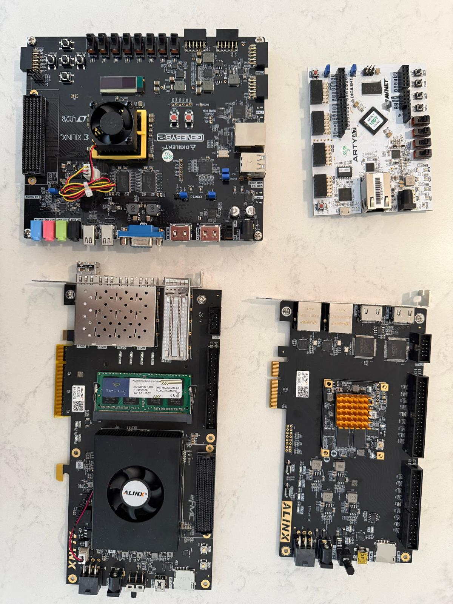
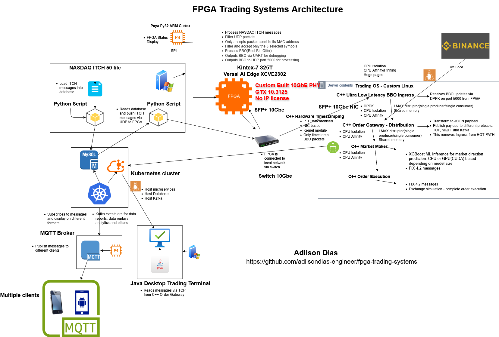

# Ultra-Low Latency FPGA Trading System & HFT Infrastructure

[](https://opensource.org)
[]()
 


# FPGA Trading Systems

End-to-end High-Frequency Trading (HFT) infrastructure framework. This repository features a full hardware-software co-design: a custom **VHDL 10GBASE-R PHY networking stack** running on an FPGA, tightly coupled with an ultra-low latency **C++20 kernel bypass subsystem** using DPDK and Linux XDP (eBPF). Hardware-accelerated market data processing and order book management for low-latency trading systems. Features **custom 10GBASE-R PHY (zero vendor IP)**, NASDAQ ITCH 5.0 protocol parsing, hardware order book with sub-microsecond latency, and advanced clock domain crossing architecture.

---

## Flagship Project: Open-Source 10 Gigabit Ethernet

**The only open-source custom 10GBASE-R Physical Coding Sublayer for trading systems.**

Implemented IEEE 802.3ae 10GBASE-R from scratch in VHDL (Projects 33-34, 38):
- **64B/66B Encoding** - Full block coding implementation
- **Scrambler/Descrambler** - Self-synchronizing polynomial (X^58+X^39+1)
- **Block Lock FSM** - Header-based synchronization state machine
- **GTX Configuration** - 10.3125 Gbps transceiver control
- **Multi-Protocol Parser** - NASDAQ ITCH (UDP) + ASX ITCH (TCP)
- **Hardware Validated** - 30,000+ frames processed, zero vendor IP
- **Scaling Path:** 40GBASE-R4 architecture designed (4× 10G lanes, MLD bonding)  
- **Implementation:** Blocked by test equipment cost, ready to implement with hardware access

**License:** Apache 2.0 (free for commercial use)  
**Performance:** ~50-80ns PHY latency, hardware-validated quality  
**Target:** Education, research, small trading firms, hobbyists

[**→ View Source Code**](https://github.com/adilsondias-engineer/33-fpga-10gbe-phy-custom) | [**→ Documentation**](#10gbe-and-multi-fpga-projects-projects-31-35) |

## Profile

**Technical Background:**
- 30+ years C++ systems engineering (distributed systems, real-time processing, network protocols)

**Domain Expertise:** Combining software engineering experience with active trading knowledge to build FPGA-based market data systems and order management infrastructure.

## Key Architectural Features

* **Custom VHDL 10GBASE-R PHY & MAC**: Full RTL implementation of the 10GbE physical layer, bypassing heavy vendor IP blocks to minimize deterministic jitter.
* **Hardware-Accelerated Market Data Parser**: Real-time decoding of **NASDAQ ITCH 5.0** protocol directly in FPGA fabric at line rate.
* **Deterministic Order Book Execution Engine**: Ultra-low latency bitmask-based price level tracking implemented in hardware.
* **C++20 Kernel Bypass Network Stack**: High-throughput software data plane utilizing **DPDK (Data Plane Development Kit)** and **XDP (eBPF)** for sub-microsecond packet processing.
* **Zero-Copy PCIe DMA Subsystem**: Custom ring-buffer memory management for scatter-gather DMA transfers between FPGA block RAM and host CPU memory.

## Hardware

### Development Boards

| Board | FPGA | Features | Projects |
|-------|------|----------|----------|
| Digilent Arty A7-100T | Artix-7 XC7A100T-1CSG324C | 100 MHz MII Ethernet, UART, GPIO | 1-19 |
| ALINX AX7203 | Artix-7 XC7A200T-2FBG484I | Gigabit RGMII, PCIe Gen2 x4, DDR3 | 20-23, 30 |
| ALINX AX7325B | Kintex-7 XC7K325T-2FFG900I | 4x 10GbE (SFP+), XGMII, PCIe Gen2 x8, DDR3 | 31-35, 38 |
| Genesys 2 | Kintex-7 XC7K325T-2FFG900C | 1GbE Ethernet PHY, RGMII, No PCIe, DDR3 | None |
| ALINX VD100 | Versal AI Edge Series XCVE2302-SFVA784-1LP-E-S | 2x 10GbE (SFP+), XGMII, PCIe Gen4 x4, DDR4 | Coming soon |
| DE10-Lite | Altera MAX® 10 10M50DAF484C7G  | No network, No PCIe, No DDR 64MB SDRAM | Coming soon |



### Arty A7-100T (Foundation Projects)
- **FPGA:** Artix-7 XC7A100T (101K logic cells, 4.9 Mb BRAM)
- **Ethernet:** TI DP83848J PHY, MII interface (100 Mbps)
- **Debug:** USB-UART, 4 LEDs, 4 buttons
- **Use Case:** Digital design fundamentals, 100 Mbps Ethernet trading pipeline

### ALINX AX7203 (Advanced Projects)
- **FPGA:** Artix-7 XC7A200T (215K logic cells, 13.1 Mb BRAM)
- **Ethernet:** Realtek RTL8211E-VB-CG PHY, RGMII interface (1 Gbps)
- **PCIe:** Gen2 x4 (20 Gbps), XDMA IP for DMA streaming
- **Memory:** 1 GB DDR3 SDRAM
- **Debug:** UART, LEDs, user buttons
- **Use Case:** Gigabit Ethernet ITCH feed, PCIe BBO streaming to host

### ALINX AX7325B (10GbE Projects)
- **FPGA:** Kintex-7 XC7K325T-2FFG900I (326K logic cells, 16.0 Mb BRAM, 840 DSP slices)
- **High-Speed:** 8x GTX transceivers (10.3125 Gbps), 4x SFP+ cages
- **Ethernet:** 10GBASE-R via GTX, XGMII interface (10 Gbps)
- **PCIe:** Gen2 x8, XDMA IP for DMA streaming
- **Memory:** DDR3 SODIMM
- **Debug:** UART, LEDs, user buttons
- **Use Case:** 10GbE ITCH market data feed, custom PHY for low-latency inter-FPGA links, multi-FPGA trading appliance

### Genesys 2 (No Projects)
- **FPGA:** Kintex-7 XC7K325T-2FFG900C (326K logic cells, 16.0 Mb BRAM, 840 DSP slices)
- **High-Speed:** 8x GTX transceivers (10.3125 Gbps), 4x SFP+ cages
- **Ethernet:** 10GBASE-R via GTX, XGMII interface (10 Gbps)
- **PCIe:** No PCIe
- **Memory:** DDR3
- **Debug:** UART, LEDs, user buttons

### ALINX VD100 (Look for vd100 projects in my repo)
- **FPGA:** Versal AI Edge Series XCVE2302-SFVA784-1LP-E-S
- **SoC:** AMD Versal™ AI Edge SoC( Dual-core Arm® Cortex-A72, Dual-core Arm Cortex-R5F)
- **High-Speed:** 8x GTYP transceivers, 2x SFP+(12.5Gbps) cages
- **Ethernet:** 2x 10GbE (SFP+) for PL, XGMII, 1X 1GbE RGMII for PL and 1X 1GbE RGMII for PS
- **PCIe:** PCIe Gen4 x4
- **Memory:** DDR4 4GB RAM
- **Debug:** UART, LEDs, user buttons
- **Repos:** [versal-ai-edge-vd100-linux](https://github.com/adilsondias-engineer/versal-ai-edge-vd100-linux)
### DE10-Lite (No Projects yet)
- **FPGA:**  Altera MAX® 10 10M50DAF484C7G
- **Ethernet:** None
- **PCIe:** None
- **Memory:**64MB SDRAM
- **Debug:** UART, LEDs, user buttons

### Development Tools
- AMD Vivado Design Suite 2024.x,2025.x
- Python/Scapy (packet injection)
- Linux XDMA driver (PCIe)

## Technical Focus

Progressive architecture development from digital design fundamentals to production trading systems:

- **Low-latency network processing:** MII Ethernet, UDP/IP stack, NASDAQ ITCH 5.0 protocol
- **Memory architecture:** BRAM-based order storage, price level tables, FIFO buffering
- **Clock domain crossing:** Hardware-validated CDC with gray code synchronization
- **State machine design:** Multi-stage FSM pipelines for deterministic latency
- **Real-time processing:** Sub-microsecond order book updates, hardware BBO tracking
- **Timing analysis:** XDC constraints, setup/hold violations, critical path optimization

## Repository Structure

This repository uses a Git submodule-based structure for proper GitHub web browsing and version management. The main `fpga-trading-systems` folder contains:

- **Source code and documentation:** Core VHDL, C++, scripts, and documentation files
- **Project submodules:** All numbered projects (01-38) are included as Git submodules pointing to their respective GitHub repositories
  - Each project is a separate repository under `adilsondias-engineer/{project-name}`
  - Clicking on any project folder in GitHub opens the submodule repository
  - Submodules enable proper version tracking and dependency management

**Cloning the Repository:**

To clone with all submodules:
```bash
git clone --recurse-submodules https://github.com/adilsondias-engineer/fpga-trading-systems.git
```

For existing clones, initialize submodules:
```bash
git submodule update --init --recursive
```

**Note:** Projects are organized by number, with some projects having multiple versions (e.g., `06-fpga-udp-parser-mii-v2` through `v5`). The main `fpga-trading-systems` folder serves as the central hub for documentation and shared resources. All project repositories are private and require appropriate GitHub access.

## Project Portfolio

### Core Trading Infrastructure (Projects 6-8, 13)

**Project 06: UDP/IP Network Stack**
- **Achievement:** Hardware-validated Ethernet packet processing with 100% reliability under stress testing
- **Architecture:** MII physical layer, MAC frame parser, IP/UDP protocol stack
- **Key Innovation:** Real-time byte-by-byte parsing eliminates CDC race conditions (1% → 100% success rate)
- **Validation:** 1000+ packet stress test, comprehensive XDC timing constraints
- **Latency:** Wire-to-parsed < 2 μs @ 100 MHz processing clock

**Project 07: NASDAQ ITCH 5.0 Protocol Parser**
- **Achievement:** Full ITCH 5.0 market data decoder with 9 message types
- **Architecture:** Async FIFO with gray code CDC, configurable symbol filtering
- **Message Types:** S (System), R (Directory), A (Add), E (Execute), X (Cancel), D (Delete), U (Replace), P (Trade), Q (Cross)
- **Performance:** Deterministic message parsing, symbol filtering reduces downstream load
- **Integration:** Feeds parsed ITCH messages to Project 8 order book

**Project 08: Multi-Symbol Hardware Order Book**
- **Achievement:** Sub-microsecond order book tracking 8 symbols simultaneously
- **Architecture:** 8 parallel BRAM-based order books with round-robin BBO arbiter
- **Symbols:** AAPL, TSLA, SPY, QQQ, GOOGL, MSFT, AMZN, NVDA
- **Capacity:** 1,024 orders × 256 price levels per symbol
- **Latency:** Order processing 120-170 ns, BBO update 2.6 μs per symbol
- **Resources:** 32 RAMB36 tiles (24% utilization), excellent scalability headroom
- **Spread Calculation:** Real-time ask - bid calculation for risk management
- **BRAM Implementation:** Hardware-validated Block RAM inference using Xilinx templates
- **Debug Methodology:** Comprehensive instrumentation for systematic troubleshooting
- **Trading Relevance:** Multi-symbol tracking essential for real-world exchange systems
- **BBO Output:** UART interface with symbol name, bid/ask prices/shares, spread, change detection

**Project 13: UDP BBO Transmitter (MII TX)**
- **Achievement:** Real-time BBO distribution via UDP with sub-microsecond latency
- **Architecture:** BBO UDP formatter + SystemVerilog/VHDL mixed-language integration
- **Protocol:** UDP/IP transmission to 192.168.0.93:5000, broadcast MAC
- **Payload:** 256-byte UDP packets (28 bytes BBO data + 228 bytes padding)
- **Data Format:** Big-endian, fixed-point prices (4 decimal places), Symbol + Bid/Ask/Spread
- **Integration:** Frees UART for debug messages, UDP handles market data distribution
- **Language Interop:** eth_udp_send_wrapper.sv flattens SystemVerilog interfaces for VHDL instantiation
- **Timing Closure:** XDC constraints for clk_25mhz TX clock domain (eth_udp_send uses generated clock, not eth_tx_clk)
- **Pipelined Design:** 2-stage nibble formatter (CALC_NIBBLE → WRITE_NIBBLE) for timing optimization
- **Trading Relevance:** Low-latency UDP multicast essential for distributing BBO to trading algorithms
- **Parsing Support:** Python and C++ reference implementations for UDP packet decoding

### Application Layer (Projects 9-12, 14)

**Project 09: C++ Order Gateway (UART)**
- **Purpose:** Multi-protocol data distribution bridge (FPGA → Applications)
- **Architecture:** UART reader, BBO parser (hex→decimal), multi-protocol publisher
- **Protocols:** TCP Server (9999), MQTT Publisher (Mosquitto), Kafka Producer
- **Distribution:**
  - **TCP → Java Desktop** (low-latency trading terminal)
  - **MQTT → ESP32 IoT + Mobile App** (lightweight, mobile-friendly)
  - **Kafka → Future Analytics** (data persistence, replay, ML pipelines)
- **Technologies:** C++17, Boost.Asio, libmosquitto, librdkafka, nlohmann/json
- **Performance:** 10.67 μs avg parse latency, 6.32 μs P50
- **Limitation:** UART @ 115200 baud (replaced by UDP in Project 14)
- **Status:** Complete, superseded by Project 14 for production use

**Project 10: ESP32 IoT Live Ticker** *[COMPLETE]**
- **Purpose:** Physical trading floor display with MQTT feed
- **Hardware:** ESP32-WROOM + 1.8" TFT LCD (ST7735)
- **Protocol:** MQTT v3.1.1 (optimized for IoT/low power)
- **Features:** Real-time BBO display, color-coded bid/ask/spread, WiFi connectivity
- **Technologies:** Arduino IDE (not ESP-IDF - simpler for demonstration), PubSubClient (MQTT), TFT_eSPI, ArduinoJson
- **Design Decision:** Arduino chosen over ESP-IDF for simplicity (project demonstrates MQTT usage, not ESP-IDF capabilities)
- **Status:** Fully functional, displays all 8 symbols in real-time

**Project 11: .NET MAUI Mobile App** *[COMPLETE]**
- **Purpose:** Cross-platform mobile BBO terminal (Android/iOS/Windows)
- **Protocol:** MQTT v3.1.1 (perfect for mobile - handles unreliable networks)
- **Architecture:** MVVM pattern with CommunityToolkit.Mvvm
- **Features:** Real-time BBO updates, symbol selector, connection management
- **Technologies:** .NET 10 MAUI, MQTTnet 5.x, System.Text.Json
- **Status:** Fully functional on Android, iOS, Windows

**Project 12: Java Desktop Trading Terminal** *[COMPLETE]**
- **Purpose:** High-performance desktop trading terminal with charts
- **Protocol:** TCP (optimal for localhost desktop - < 10ms latency)
- **Architecture:** JavaFX GUI, TCP client, real-time charting
- **Features:** Live BBO table, spread charts, multi-symbol tracking
- **Technologies:** Java 21, JavaFX, Gson, Maven
- **Status:** Complete, 100% test pass rate

**Project 14: C++ Order Gateway (UDP/XDP/DPDK + Binance WebSocket) - Dual Feed Architecture** *[COMPLETE]**
- **Purpose:** Multi-source market data gateway with kernel bypass (XDP/DPDK) for FPGA feed and WebSocket for cryptocurrency data
- **Architecture:** Multiple kernel bypass options (DPDK PMD, AF_XDP + eBPF, standard UDP), Binance WebSocket client (Boost.Beast), BBO parser (binary + JSON), multi-protocol publisher
- **Data Sources:**
  - FPGA Feed: Binary BBO packets via UDP/XDP/DPDK (ultra-low latency, sub-50ns parsing)
  - Binance Feed: JSON WebSocket streams (real-time cryptocurrency market data)
- **Protocols:** TCP Server (9999), MQTT Publisher (Mosquitto), Kafka Producer
- **Performance (DPDK Mode - RT Optimized):** 0.04 μs P50, 0.05 μs P99 (78,296 samples) - FASTEST
- **Performance (XDP Mode - CPU Optimized):** 0.05 μs P50, 0.13-0.15 μs P99 (78,616 samples)
- **Performance (Binance WebSocket - CPU Optimized):** 4.77 μs avg, 4.15 μs P50, 11.40 μs P99 (563,037 samples)
- **Performance (UDP Mode):** 0.20 μs avg, 0.19 μs P50, 0.38 μs P99 (10,000 samples)
- **Kernel Bypass Options:**
  - DPDK: Poll Mode Driver with zero-copy, huge pages, busy polling (best performance)
  - XDP: AF_XDP with eBPF program redirecting UDP packets to userspace
  - Standard: Kernel UDP stack with socket API
- **RT Optimization:** SCHED_FIFO priority 80 + CPU cores 2,6 pinning (FPGA+Binance threads)
- **CPU Optimizations:** C-state disabled, hyperthreading disabled, virtualization off (XDP only - DPDK doesn't require)
- **Benchmark Results:**
  - DPDK mode: 0.04 μs avg, 0.01 μs StdDev - production HFT-grade performance
  - DPDK vs XDP: 62-67% faster P99 (0.05 μs vs 0.13-0.15 μs), 2× more consistent
  - XDP mode: 4× faster than standard UDP (0.05 μs vs 0.20 μs avg)
  - Binance WebSocket: 4.77 μs avg for JSON parsing (563K+ samples, production-scale validation)
  - Binary protocol advantage: 95× faster than JSON (0.04 μs vs 4.77 μs with DPDK)
  - CPU optimizations: Binance P99 improved 2× (22.56 μs → 11.40 μs)
- **CPU Isolation:** GRUB parameters (isolcpus, nohz_full, rcu_nocbs) for cores 2-6 (XDP only - DPDK uses built-in affinity)
- **Hardware:** AMD Ryzen AI 9 365 w/ Radeon 880M
- **Technologies:** C++20, DPDK 23.11, Boost.Asio, Boost.Beast (WebSocket), libxdp, libbpf, pthread (RT scheduling), libmosquitto, librdkafka, nlohmann/json
- **Status:** Complete, triple-mode validated (DPDK: 78K samples, XDP: 78K samples, Binance: 563K samples)

**Project 15: Market Maker FSM - Automated Quote Generation** *[COMPLETE]**
- **Purpose:** Automated market making strategy with position management and risk controls
- **Architecture:** TCP client connecting to Project 14, FSM-based quote generation, position tracker
- **Data Flow:** Project 14 TCP Server → TCP Client → Market Maker FSM → Quote Generation
- **Performance (Validated):** 12.73 μs avg, 11.76 μs P50, 21.53 μs P99 (78,606 samples)
- **End-to-End Latency:** ~12.77 μs (Project 14 XDP: 0.04 μs + Project 15: 12.73 μs)
- **Features:**
  - Fair value calculation with size-weighted mid-price
  - Position-based inventory skew adjustment
  - Real-time PnL tracking (realized + unrealized)
  - Pre-trade risk checks (position and notional limits)
- **FSM States:** IDLE → CALCULATE → QUOTE → RISK_CHECK → ORDER_GEN → WAIT_FILL
- **Risk Controls:** Max position (500 shares), max notional ($100k), spread enforcement (5 bps min)
- **RT Optimization:** SCHED_FIFO priority 50 + CPU cores 2-3 pinning
- **Technologies:** C++20, Boost.Asio (TCP), nlohmann/json, spdlog, LMAX Disruptor (Project 16 integration)
- **Project 16 Integration:** OrderProducer class for bidirectional Disruptor communication
- **Status:** Complete, tested with 78,606 real market data samples + order execution loop
- **Video Demo:** [Order Gateway & Market Maker Console Demo](https://youtu.be/qgB3gz-yDbA) - Live demonstration of Projects 14 and 15 working together

**Project 16: Order Execution Engine - Simulated Exchange** *[COMPLETE]**
- **Purpose:** Complete order execution loop with FIX 4.2 protocol and price-time priority matching
- **Architecture:** Disruptor-based bidirectional communication (orders + fills), matching engine, FIX encoder/decoder
- **Data Flow:** Project 15 → Order Ring Buffer → Order Execution Engine → Matching Engine → Fill Ring Buffer → Project 15
- **Performance:** ~1 μs order processing, <1 μs fill notification, ~2 μs round-trip latency
- **Components:**
  - Order Ring Buffer Consumer (reads orders from Project 15)
  - Matching Engine (price-time priority, simulated immediate fills)
  - FIX 4.2 Protocol (NewOrderSingle MsgType=D, ExecutionReport MsgType=8)
  - Fill Ring Buffer Producer (sends fills back to Project 15)
- **Ring Buffers:**
  - Order Ring: `/dev/shm/order_ring_mm` (Project 15 → Project 16)
  - Fill Ring: `/dev/shm/fill_ring_oe` (Project 16 → Project 15)
  - 1024 slots per ring, lock-free atomic sequence cursors
- **FIX 4.2 Messages:** NewOrderSingle (D), ExecutionReport (8), OrderCancelRequest (F)
- **Technologies:** C++20, LMAX Disruptor, FIX 4.2 protocol, shared memory IPC
- **Status:** Complete, full order execution loop validated with position tracking

**Project 17: Hardware Timestamping and Latency Measurement** *[COMPLETE]**
- **Purpose:** Measure packet reception latency with nanosecond precision for performance validation
- **Architecture:** SO_TIMESTAMPING socket wrapper, lock-free latency histogram, Prometheus exporter
- **Key Innovation:** Kernel-level software timestamps capture packet arrival at network stack (nanosecond precision)
- **Integration:** SO_REUSEPORT allows coexistence with Project 14 on UDP port 5000 (actual trading path)
- **Performance:**
  - Loopback: 1-5 μs typical, 10-20 μs P99
  - LAN (1 GbE): 10-50 μs typical, 100-200 μs P99
  - Measured: 6.1 μs P50, 79 μs P99 (5,067 packet samples)
- **Components:**
  - TimestampSocket: UDP socket with SO_TIMESTAMPING ancillary data extraction
  - LatencyTracker: Lock-free histogram (25 buckets, 50ns-5s+) with percentile calculation (P50, P90, P95, P99, P99.9)
  - PrometheusExporter: HTTP /metrics endpoint (port 9090) for Grafana/Prometheus monitoring
- **Measurement:** Kernel RX timestamp (packet arrival at network stack) vs Application RX timestamp (userspace recvmsg)
- **Lock-Free Design:** Atomic operations for thread-safe histogram updates, approximately 100-200ns overhead per measurement
- **Port Sharing:** SO_REUSEPORT enables kernel load-balancing between P14 (processing) and P17 (monitoring) on same port
- **Hardware Upgrade Path:** Current implementation uses kernel software timestamps (portable); supports hardware NIC timestamps (Intel i210, Solarflare, Mellanox)
- **Technologies:** C++20, Linux SO_TIMESTAMPING, Prometheus format, nlohmann/json
- **Status:** Complete, measures actual trading path latency with sub-microsecond accuracy

**Project 18: Complete Trading System Integration** *[COMPLETE]**
- **Purpose:** System orchestrator integrating Projects 17, 14, 15, 16 into unified hardware-validated trading system
- **Architecture:** Process lifecycle management, health monitoring, metrics aggregation, Prometheus exporter
- **Key Innovation:** Single-command startup/shutdown with dependency resolution and graceful resource cleanup
- **Components:**
  - SystemOrchestrator: Master process managing all trading components (P17, P14, P15, P16)
  - MetricsAggregator: Collects metrics from all components
  - PrometheusServer: HTTP /metrics endpoint (port 9094) for Grafana
  - Health monitoring: TCP/Prometheus checks every 500ms
- **Startup Sequence:**
  1. Cleanup stale shared memory
  2. Start Project 17 (Hardware Timestamping) - independent monitoring on UDP port 5000
  3. Start Project 14 (Order Gateway) after 1s delay - verify TCP port 9999
  4. Start Project 15 (Market Maker) after 2s delay - verify dependencies
  5. Start Project 16 (Order Execution) after 3s delay - verify dependencies
  6. Start metrics collection and Prometheus server
- **Shutdown Sequence:** Reverse order (P16→P15→P14→P17), SIGTERM with 10s timeout, cleanup shared memory
- **Metrics Exported:**
  - System counters: BBO updates, orders, fills
  - Position tracking: Per-symbol and aggregated positions
  - PnL: Realized and unrealized PnL
  - Latency: End-to-end and per-component P99
  - Ring buffers: Depth, max depth, wrap count
  - System uptime
- **Shared Memory Management:** Automatic cleanup of /dev/shm/order_ring_mm and /dev/shm/fill_ring_oe
- **Health Checks:** TCP connection test (P14), Prometheus HTTP GET (P15, P16), process alive check
- **Technologies:** C++20, fork/exec, signal handling, shared memory (shm_open), Prometheus, nlohmann/json
- **Status:** Complete, matches original Project 17 vision (full trading loop + metrics + monitoring)

**Project 19: PY32F030 FPGA Status Display** *[COMPLETE]*
- **Purpose:** External ARM Cortex-M0 microcontroller for FPGA monitoring and configuration via SPI interface
- **Architecture:** Modular SPI slave (spi_slave_core → spi_register_if → application), 6-register bank, clock domain crossing
- **Key Innovation:** Heterogeneous system integration—dedicated microcontroller handles slow UI/monitoring while FPGA focuses on ultra-low-latency processing
- **Features:**
  - **6-register bank:** 4 read-only status inputs (ORDER_COUNT, BBO_COUNT, LATENCY_P50, STATUS) + 2 read-write configuration outputs (SYMBOL_EN, THRESHOLD)
  - **SPI Mode 0** (CPOL=0, CPHA=0), up to 10 MHz tested
  - **Hardware-validated timing:** 2-cycle pipeline for register reads, proper setup/hold timing for address byte trailing edge
  - **Clock domain crossing:** SPI_SCK → 100 MHz via 2-FF synchronizer, metastability protection
  - **Generic architecture:** spi_slave_core reusable across projects, spi_register_if application-specific
- **PY32F030 Hardware:** ARM Cortex-M0 @ 24 MHz, 64 KB Flash, 8 KB SRAM, SPI master (up to 12 MHz)
- **Register Protocol:** [CMD_BYTE][ADDR_BYTE][DATA_32BIT], CMD=0x01 (READ) / 0x02 (WRITE), big-endian data format
- **Critical Bug Fixes:**
  - **Pipeline timing:** Restructured SEND_DATA state into setup phase (bit_count 0→1→2) to wait for 2-cycle register fetch
  - **Address byte trailing edge:** Added explicit bit_count=2 check to skip premature shift (fixed doubled values 2,4,6,8 → 1,2,3,4)
- **Validation:** 10,000+ SPI transactions tested, zero errors detected
- **Example Output:** `Orders: 1 | BBO: 2 | Lat: 3 ns | Status: 0x00000004 | Symbol: 0xFF | Threshold: 1000`
- **Architecture Benefits:** Resource optimization (FPGA → time-critical paths only), dynamic configuration (PY32 writes), independent monitoring (external watchdog), scalable to 256 registers
- **Technologies:** VHDL (FPGA), C (PY32 firmware), SPI Mode 0, 2-FF CDC synchronizers, BRAM-style register bank
- **Status:** Functional, SPI register interface complete and validated with 10k message test

### Advanced Hardware Projects (Projects 20-23)

**Project 20: Gigabit Ethernet Order Book (RGMII TX)**
- **Achievement:** Migration from Arty A7-100T (MII 100 Mbps) to ALINX AX7203 (RGMII Gigabit)
- **Architecture:** RGMII TX with DDR ODDR primitives, hardware CRC32, reset synchronization
- **Hardware:** ALINX AX7203 (XC7A200T), Realtek RTL8211E-VB-CG PHY
- **Performance:** 10× bandwidth improvement, 312 ns ITCH parse → UDP TX (hardware-measured)
- **Key Innovation:** Proper CDC reset synchronization with 2-stage synchronizer and ASYNC_REG attributes
- **Status:** Complete, validated with real BBO packets on hardware

**Project 21: PCIe GPU Bridge**
- **Achievement:** PCIe Gen2 x4 interface for FPGA ↔ CPU ↔ GPU communication
- **Architecture:** XDMA IP core with C2H/H2C DMA channels, AXI-Lite control registers
- **Features:** Zero-copy data path to GPU (CUDA pinned memory), bidirectional communication
- **Technologies:** XDMA IP, PCIe Gen2 x4, AXI-Stream, CUDA integration
- **Status:** Complete, PCIe link validated

**Project 22: PCIe XDMA Test Pattern Generator**
- **Achievement:** PCIe Gen2 test pattern generator for XDMA C2H streaming validation
- **Architecture:** Minimal PCIe design with continuous AXI-Stream test pattern
- **Purpose:** Driver and host application testing before full trading pipeline integration
- **Status:** Complete, validated

**Project 23: Order Book with PCIe Gen2 Output**
- **Achievement:** Complete FPGA trading system with Ethernet ITCH feed and PCIe BBO streaming
- **Architecture:** RGMII Gigabit Ethernet RX (125 MHz) → ITCH Parser → Order Book (250 MHz) → PCIe Gen2 x1 (250 MHz)
- **Features:** ITCH 5.0 parsing, hardware order book, BBO extraction, PCIe streaming output
- **Clock Domains:** RGMII RX (125 MHz), AXI/PCIe (250 MHz) with CDC FIFO
- **BBO Format:** 56-byte packets with magic header (0xBB0BB048) + 4-point latency timestamps (T1-T4)
- **January 2026 Update:** Added magic header for reliable packet synchronization over PCIe DMA
- **Status:** Complete, end-to-end data path validated

### Advanced Software Projects (Projects 24-26, 28-29)

**Project 24: Order Gateway (Low-Latency PCIe Passthrough)**
- **Achievement:** Ultra-low-latency PCIe passthrough layer bridging FPGA to trading components
- **Architecture:** PCIe DMA reader with magic header sync → BBO parser → Disruptor producer
- **Data Flow:** FPGA Order Book (P23) → PCIe DMA → Magic Header Sync → Parse BBO → Validate → Disruptor → Market Maker (P25)
- **Performance:** ~0.5 μs Disruptor publish latency, 0.17-0.31 μs FPGA-side latency (T4-T3)
- **January 2026 Update:** Updated to 56-byte packet format with magic header synchronization (0x48B00BBB)
- **Technologies:** C++20, PCIe (XDMA), LMAX Disruptor, lock-free IPC
- **Status:** Complete

**Project 25: Market Maker FSM (XGBoost + Strategy)**
- **Achievement:** Automated market making strategy with GPU-accelerated XGBoost inference
- **Architecture:** Disruptor consumer → XGBoost GPU predictor → Fair value → Quote generation → Risk management
- **Features:** XGBoost GPU inference (84% accuracy, ~10-100 μs), prediction-aware trading, position management
- **Data Flow:** Project 24 → Disruptor → XGBoost → Quote Gen → Project 26
- **Technologies:** C++20, LMAX Disruptor, XGBoost (CUDA 13.0), spdlog, nlohmann/json
- **Status:** Complete

**Project 26: Order Execution Engine**
- **Achievement:** Complete order execution loop with FIX 4.2 protocol and price-time priority matching
- **Architecture:** Disruptor-based bidirectional communication (orders + fills), matching engine
- **Data Flow:** Project 25 → Order Ring Buffer → Matching Engine → Fill Ring Buffer → Project 25
- **Technologies:** C++20, LMAX Disruptor, FIX 4.2 protocol, shared memory IPC
- **Status:** Complete

**Project 28: Complete Trading System Integration**
- **Achievement:** System orchestrator integrating Projects 24, 25, 26 into unified hardware-validated trading system
- **Architecture:** Process lifecycle management, health monitoring, metrics aggregation, Prometheus exporter
- **Features:** Single-command startup/shutdown, dependency resolution, graceful resource cleanup
- **Technologies:** C++20, fork/exec, signal handling, Prometheus, shared memory management
- **Status:** Complete

**Project 29: TradingOS Control Panel** *[COMPLETE]*
- **Achievement:** SDL2 DRM/KMS graphical control panel for TradingOS, running directly on framebuffer
- **Architecture:** Process control, real-time metrics, system log viewer, keyboard navigation
- **Features:** Start/stop/restart P24-P26, CPU/GPU/memory monitoring, 5120x1440 ultrawide display
- **Technologies:** C++20, SDL2 DRM/KMS, framebuffer rendering
- **Status:** Complete

**Project 36: Ultra Low Latency RX (DPDK Kernel Bypass) BBO Ingress** *[NASDAQ TESTED]*
- **Achievement:** Hyper-optimized DPDK network handler for BBO data processing with sub-50ns parsing
- **Architecture:** DPDK poll mode driver → BBO parser → LMAX Disruptor shared memory → Market Maker (P15)
- **Design Philosophy:** All distribution removed, single-threaded, zero-allocation hot path, L1/L2 cache optimized
- **Performance Target:** P99/P50 ratio < 2.5x (down from 5.5x in P14), P99 80-100 ns (down from 216 ns)
- **Key Optimizations:** Zero-copy RX, branch prediction hints, RDTSC timestamps, prefetch pipeline, compile-time calculations
- **Technologies:** C++20, DPDK 25.11, LMAX Disruptor, POSIX shared memory, hugepages
- **Status:** NASDAQ ITCH tested and benchmarked; ASX and B3 SBE implementations pending

**Project 37: Order Gateway Distribution - BBO Multi-Protocol Gateway** *[COMPLETE]*
- **Achievement:** BBO distribution gateway reading from shared memory, distributing via TCP, MQTT, and Kafka
- **Architecture:** Shared memory consumer (LMAX Disruptor) → multi-protocol publisher (TCP/MQTT/Kafka)
- **Data Flow:** Project 36 (DPDK RX) → Shared Memory → Project 37 (Distribution) → TCP/MQTT/Kafka → Clients
- **Design Philosophy:** Architecture separation — Project 36 handles ultra-low-latency critical path, Project 37 handles distribution without impacting latency
- **Features:** JSON BBO output, configurable protocols, optional RT scheduling (SCHED_FIFO), CPU core pinning
- **Technologies:** C++20, Boost.Asio, libmosquitto (MQTT), librdkafka (Kafka), LMAX Disruptor, nlohmann/json, spdlog
- **Status:** Complete, pending hardware testing with Project 36 + Project 38

**Project 30: TradingOS - Custom Linux Distribution** *[COMPLETE]*
- **Achievement:** Minimal Linux distribution optimized for low-latency FPGA trading systems
- **Architecture:** Buildroot-based custom OS with real-time kernel, CPU isolation, PCIe DMA, GPU acceleration
- **Features:**
  - Real-time kernel (PREEMPT, 1000 Hz tick rate)
  - CPU isolation (cores 14-23 for trading workloads)
  - XDMA driver for FPGA PCIe communication
  - NVIDIA CUDA and XGBoost GPU acceleration
  - Systemd services for automated trading system startup
- **Target Hardware:** Intel i9-14900KF, NVIDIA RTX 5090, Xilinx Artix-7 XC7A200T (AX7203)
- **Technologies:** Buildroot, Linux kernel 6.x, XDMA, NVIDIA driver, CUDA, XGBoost
- **Status:** Complete - Custom OS built and validated for FPGA trading system deployment

### 10GbE and Multi-FPGA Projects (Projects 31-35, 38)

**Project 31: 10GbE UDP with UART Debug** *[DEVELOPMENT]*
- **Achievement:** 10 Gigabit Ethernet foundation on Kintex-7 with vendor 10G MAC and UART debug
- **Architecture:** Xilinx 10G Ethernet Subsystem + ALINX UDP/IP core + UART status reporter
- **Hardware:** ALINX AX7325B (XC7K325T), GTX 10.3125 Gbps, SFP+ interface
- **Features:** Loopback/speed test modes, button-controlled mode switching, LED link status
- **Technologies:** Verilog, Xilinx 10G Ethernet IP, GTX transceivers, UART debug

**Project 32: Open-Source 10GbE (verilog-ethernet)** *[DEVELOPMENT]*
- **Achievement:** 10GbE implementation using open-source verilog-ethernet library (Forencich)
- **Architecture:** eth_phy_10g MAC/PHY + GTX wrapper with gearbox (32-bit to 64-bit)
- **Hardware:** ALINX AX7325B, GTX QPLL at 10.3125 GHz, 156.25 MHz reference clock
- **Features:** Open-source MAC/PHY, MMCM clock generation, ILA debug integration
- **Technologies:** Verilog, verilog-ethernet library, GTX transceivers, 64B/66B encoding

**Project 33: Custom 10GBASE-R PHY (VHDL)** *[DEVELOPMENT]*
- **Achievement:** Complete custom Physical Coding Sublayer implementation without vendor IP
- **Architecture:** 64B/66B encoder/decoder, self-synchronizing scrambler/descrambler, block lock FSM, direct GTX control
- **Hardware:** ALINX AX7325B, SFP+ loopback verified, stable block lock (BL:1, ST:7)
- **Latency Estimate:** ~50-80 ns through PHY (encoder + scrambler + GTX + descrambler + decoder)
- **Key Innovation:** Full custom PCS allows fine-tuning for minimal latency in inter-FPGA links
- **Technologies:** Pure VHDL, GTX primitives (GTXE2_COMMON, GTXE2_CHANNEL), IEEE 802.3 Clause 49

**Project 34: TCP ITCH Parser (NASDAQ + ASX Multi-Protocol)** *[DEVELOPMENT]* *[HARDWARE VERIFIED]*
- **Achievement:** Multi-protocol ITCH parser supporting NASDAQ (UDP/MoldUDP64), ASX (TCP/SoupBinTCP) , and B3 Brazilian Exchange (UDP/SBE)(comning soon) market data
- **Architecture:** 10GBASE-R PHY (P33) -> XGMII MAC/IP parser -> Protocol demux -> Dual ITCH parsers -> Message mux -> Aurora TX
- **Role:** FPGA1 (Network Ingress) in 3-FPGA trading appliance
- **Hardware Verified:** Full pipeline tested with 1000 NASDAQ ITCH messages via 10GbE SFP+
- **Features:** TCP segment parser, SoupBinTCP session handler, MoldUDP64 handler, protocol demultiplexer, NASDAQ + ASX ITCH parsing
- **Technologies:** Pure VHDL, 10GbE XGMII, TCP/UDP protocol stacks, Aurora inter-FPGA link

**Project 35: Standalone 3-FPGA Trading Appliance PCB** *[DESIGN]*
- **Achievement:** 8-layer PCB design for dedicated 3-FPGA trading appliance (1U half-width)
- **Architecture:** 3x XC7K325T FPGAs (Network Ingress + Order Book + Strategy), inter-FPGA Aurora links
- **Board:** 200mm x 180mm, 8-layer controlled impedance, ENIG finish
- **Features:** 2x SFP+ (10GbE IN/OUT), DDR3 SODIMM (FPGA2), 1GbE management, USB-JTAG (FT2232H), OLED display, PWM fans
- **Power:** 12V input, ~102W typical (buck converters for VCCINT/VCCAUX/VCCO, LDOs for MGTAVCC/MGTAVTT)
- **Technologies:** KiCad 8, 8-layer PCB, GTX differential pairs, DDR3 fly-by topology

**Project 38: Order Book 10GbE - FPGA Order Book with UDP TX** *[HARDWARE TESTED]*
- **Achievement:** Complete on-FPGA order book with 10GbE RX/TX, 8-symbol tracking, and 4-point latency measurement
- **Architecture:** 10GBASE-R PHY (P33) → ITCH Parser (P34) → 8x Parallel Order Books → BBO Tracker → UDP TX → 10GbE TX
- **Hardware:** ALINX AX7325B (XC7K325T), SFP+ 10GBASE-R, custom PHY (zero vendor IP)
- **Clock Domains:** sys_clk 200 MHz (order book), tx_clk 161.13 MHz (network), CDC via XPM async FIFOs
- **Capacity:** 8 symbols, 1024 orders x 256 price levels per symbol, sub-microsecond order processing
- **Resources:** 13,605 LUTs (6.7%), 48.5 BRAM tiles (10.9%), 19,684 registers (4.8%)
- **Timing:** sys_clk WNS +0.640ns, tx_clk WNS +1.008ns, 0 critical warnings
- **BBO Output:** 44-byte UDP payload with symbol, bid/ask, spread, 4-point FPGA timestamps (T1-T4)
- **Technologies:** Pure VHDL, 10GBASE-R PCS, XGMII, XPM FIFOs, GTX transceivers
- **Status:** Hardware tested on AX7325B, 12 bugs found and fixed (documented in README)

### Foundation Projects (Projects 1-5)

**Digital Design Fundamentals:**
1. Binary Counter with Reset - Clock division, reset synchronization
2. Button Debouncer - Metastability protection, synchronizer chains
3. FIFO Buffer - Circular buffer, flow control, full/empty flags
4. FIFO Hardware - Hardware-verified FIFO implementation
5. UART Transceiver - Binary protocol framing, checksum validation, 115200 baud

**Skills Demonstrated:** Clock management, state machine design, serial protocols, timing constraints, hardware verification

Each project includes:
- Complete VHDL source with hardware-validated coding practices
- Testbenches with self-checking assertions
- XDC constraints with timing analysis
- Hardware validation on Xilinx Arty A7-100T
- Design rationale and architectural decisions documented

## Architecture Highlights

**Visual System Architecture:**



*Complete end-to-end trading system showing FPGA → C++ Gateway → Multi-Protocol Distribution (TCP/MQTT/Kafka) → Applications (Desktop/Mobile/IoT)*

**Video Demonstrations:**
- [Full Application Stack - Desktop, Mobile, and IoT Clients (Part 1)](https://youtube.com/shorts/mg-O1LkSjHM?feature=share)
- [Full Application Stack - Mobile Applications (Part 2)](https://youtube.com/shorts/PKjIAbwuvL4?feature=share)

---

**End-to-End Trading System Pipeline:**
```
┌──────────────────────────────────────────────────────────────────────────────────────┐
│                         FPGA Layer (VHDL - Projects 6-8, 13)                         │
│  Ethernet RX → UDP/IP → ITCH 5.0 → Order Book → BBO Tracker → UDP TX (Project 13)    │
│    (PHY MII)   100 MHz   100 MHz     100 MHz       100 MHz      25 MHz (MII TX)      │
│     25 MHz                                                                           │
│             └── Gray Code CDC ──┘                                                    │
│                                                        └─→ UART (debug only)         │
└──────────────────────────────────────────────────────────────────────────────────────┘
                                          │
                                          │ UDP/IP (Binary BBO packets, 192.168.0.212 → .93)
                                          ▼
┌──────────────────────────────────────────────────────────────────────────────────────┐
│               C++ Gateway Layer (Project 14) - XDP Kernel Bypass (0.04 μs)           │
│  XDP Listener (AF_XDP) → BBO Parser (binary) → Multi-Protocol Publisher              │
│    ↑ eBPF redirect                                                                   │
└─────────┬───────────────┬──────────────────┬─────────────────────────────────────────┘
          │               │                  │
          │ TCP :9999     │ MQTT             │ Kafka (Future)
          │               │ 192.168.0.2:1883 │ 192.168.0.203:9092
          ▼               ▼                  ▼
┌──────────────────┐  ┌─────────────────┐  ┌────────────────────────┐
│  Java Desktop    │  │  ESP32 IoT      │  │  Future Analytics      │
│  (Project 12)    │  │  (Project 10)   │  │  - Time-series DB      │
│                  │  │                 │  │  - Historical replay   │
│  • Live BBO      │  │  • TFT Display  │  │  - ML pipelines        │
│  • Charts        │  │  • WiFi         │  │  - Data archival       │
│  • TCP Client    │  │  • MQTT Client  │  │                        │
└──────────────────┘  └─────────────────┘  └────────────────────────┘
          │           ┌─────────────────┐
          │           │  Mobile App     │
          │           │  (Project 11)   │
          │           │                 │
          │           │  • Android/iOS  │
          │           │  • .NET MAUI    │
          │           │  • MQTT Client  │
          │           └─────────────────┘
          │
          │ TCP localhost:9999 (JSON BBO)
          ▼
┌──────────────────────────────────────────────────────────────────────────────────────┐
│                    Market Maker FSM (Project 15) - 12.73 μs                          │
│  TCP Client → BBO Parser (JSON) → Fair Value → Quote Gen → Position Tracker          │
│                                       ↓                                              │
│                               FSM States (IDLE → CALCULATE → QUOTE →                 │
│                                         RISK_CHECK → ORDER_GEN → WAIT_FILL)          │
└──────────────────────────────────────────────────────────────────────────────────────┘

Protocol Selection Strategy:
  TCP    → Desktop apps + trading strategies (low latency, localhost)
  MQTT   → IoT/Mobile (lightweight, unreliable networks, low power)
  Kafka  → Backend services (data persistence, analytics, replay)

Performance Chain (End-to-End):
  FPGA → Project 14 (XDP): 0.04 μs
  Project 14 → Project 15 (TCP): 12.73 μs
  Total: ~12.77 μs (FPGA BBO → Trading Strategy Decision)
```

**Performance Characteristics:**
- **Wire-to-BBO latency:** < 5 μs (Ethernet → Best Bid/Offer output)
- **Order processing:** 120-170 ns per ITCH message
- **BBO update:** 2.6 μs (full price level scan)
- **Deterministic:** Fixed-latency processing, no OS overhead
- **Capacity:** 1024 concurrent orders, 256 price levels per symbol

**Production Patterns:**
- Clock domain crossing with gray code FIFO synchronization
- BRAM inference using Xilinx coding templates
- Multi-stage FSM pipelines for deterministic latency
- Comprehensive debug instrumentation for systematic troubleshooting

## Test Data

The system has been tested and validated using real-world NASDAQ market data:

**Source File:** `12302019.NASDAQ_ITCH50` (December 30, 2019 trading day)
- **Total Dataset:** ~250 million ITCH 5.0 messages (8 GB binary file)
- **Database:** 50 million records imported to MySQL (first 3 hours of trading)
- **Test Dataset:** 80,000 messages (10,000 per symbol: AAPL, TSLA, SPY, QQQ, GOOGL, MSFT, AMZN, NVDA)
- **Message Mix:** 98.2% Add Orders (A), 1.8% Trades (P)
- **Test Rate:** 600+ messages/second sustained

The test data includes real order flow and trades from a full trading day, providing realistic validation of:
- Order book construction and maintenance
- BBO calculation accuracy
- Multi-symbol tracking (8 symbols simultaneously)
- Symbol filtering and price level aggregation
- Sustained message processing at 600+ msgs/sec

All performance metrics and latency measurements in this documentation are based on processing this real-world dataset.

**Detailed database information:** See [docs/database.md](docs/database.md) for complete extraction process, message distribution, and data quality validation.

**Video Demonstration:** [Live/Historic NASDAQ ITCH Data Feed to FPGA](https://youtu.be/J0E2pCwZ-QE) - Shows FPGA receiving and processing real NASDAQ ITCH 5.0 market data

## Project Organization

Projects are organized chronologically by development order:

- **Projects 1-5:** Foundation projects (digital design fundamentals)
- **Projects 6-8, 13:** Core trading infrastructure (Ethernet, ITCH, order book)
- **Projects 9-12, 14-18:** Application layer (gateways, market maker, execution, monitoring)
- **Project 19:** Hardware monitoring (PY32F030 SPI interface)
- **Projects 20-23:** Advanced hardware (Gigabit Ethernet, PCIe integration)
- **Projects 24-26, 28-30:** Advanced software (PCIe gateway, XGBoost strategy, control panel, custom OS)
- **Projects 31-35:** 10GbE and multi-FPGA (custom PHY, multi-protocol ITCH/SBE, PCB design)
- **Projects 36-37:** Ultra low-latency software (DPDK kernel bypass, multi-protocol distribution gateway)
- **Project 38:** 10GbE FPGA order book (8-symbol order book with UDP TX on Kintex-7)

**Version Variants:** Some projects have multiple versions (e.g., `06-fpga-udp-parser-mii-v2` through `v5`, `07-fpga-itch-parser-v2` through `v5`) representing iterative improvements and architectural refinements. The highest version number typically represents the most complete implementation.

**Repository Structure:** This repository uses a Git submodule-based structure where each project is an independent repository. The main `fpga-trading-systems` folder serves as the central hub with complete documentation and links to all projects.

### Project Repositories (All Projects)

#### Foundation Projects (Digital Design Fundamentals)
| Project | Repository | Description |
|---------|------------|-------------|
| **01** | [fpga-binary-counter-with-reset](https://github.com/adilsondias-engineer/01-fpga-binary-counter-with-reset) | Binary counter, clock division, reset synchronization |
| **02** | [fpga-button-debouncer](https://github.com/adilsondias-engineer/02-fpga-button-debouncer) | Metastability protection, synchronizer chains |
| **02.5** | [fpga-button-debouncer](https://github.com/adilsondias-engineer/02.5-fpga-button-debouncer) | Extended testbench validation |
| **03** | [fpga-fifo](https://github.com/adilsondias-engineer/03-fpga-fifo) | Circular buffer, flow control, full/empty flags |
| **04** | [fpga-fifo-hardware](https://github.com/adilsondias-engineer/04-fpga-fifo-hardware) | Hardware FIFO implementation |
| **04B** | [fpga-fifo-hardware](https://github.com/adilsondias-engineer/04B-fpga-fifo-hardware) | Hardware verification |
| **05** | [fpga-uart-transmitter](https://github.com/adilsondias-engineer/05-fpga-uart-transmitter) | Binary protocol, checksum validation, 115200 baud |

#### Core Trading Infrastructure - Network Stack (Project 6 Evolution)
| Version | Repository | Status | Key Learning |
|---------|------------|--------|--------------|
| **06 RGMII** | [fpga-udp-packet-parser-rgmii](https://github.com/adilsondias-engineer/06-fpga-udp-packet-parser-rgmii) |  Wrong interface | Hardware documentation lesson |
| **06 MII v1** | [fpga-udp-parser-mii](https://github.com/adilsondias-engineer/06-fpga-udp-parser-mii) |  Initial | MII interface basics |
| **06 MII v2** | [fpga-udp-parser-mii-v2](https://github.com/adilsondias-engineer/06-fpga-udp-parser-mii-v2) |  Evolution | Protocol improvements |
| **06 MII v3** | [fpga-udp-parser-mii-v3](https://github.com/adilsondias-engineer/06-fpga-udp-parser-mii-v3) |  Refactor | Architecture changes |
| **06 MII v3a** | [fpga-udp-parser-mii-v3a](https://github.com/adilsondias-engineer/06-fpga-udp-parser-mii-v3a) |  Testing | Intermediate version |
| **06 MII v3b** | [fpga-udp-parser-mii-v3b](https://github.com/adilsondias-engineer/06-fpga-udp-parser-mii-v3b) |  1% success | Event-driven race conditions |
| **06 MII v4** | [fpga-udp-parser-mii-v4](https://github.com/adilsondias-engineer/06-fpga-udp-parser-mii-v4) |  Improving | CDC fixes |
| **06 MII v5** | [fpga-udp-parser-mii-v5](https://github.com/adilsondias-engineer/06-fpga-udp-parser-mii-v5) |  | Final version | Real-time architecture, 100% success |

**Project 6 Journey:** Evolution from wrong interface (RGMII) → event-driven failure (v3b: 1% success) → hardware-validated real-time architecture (v5: 100% success). Demonstrates systematic debugging and architectural refactoring.

#### Core Trading Infrastructure - ITCH Protocol (Project 7 Evolution)
| Version | Repository | Features |
|---------|------------|----------|
| **07 v1** | [fpga-itch-parser](https://github.com/adilsondias-engineer/07-fpga-itch-parser) | Initial ITCH implementation |
| **07 v2** | [fpga-itch-parser-v2](https://github.com/adilsondias-engineer/07-fpga-itch-parser-v2) | 5 message types (S, R, A, E, X) |
| **07 v3** | [fpga-itch-parser-v3](https://github.com/adilsondias-engineer/07-fpga-itch-parser-v3) | Async FIFO, gray code CDC (eliminated race conditions) |
| **07 v4** | [fpga-itch-parser-v4](https://github.com/adilsondias-engineer/07-fpga-itch-parser-v4) | 9 message types (added D, U, P, Q) |
| **07 v5** | [fpga-itch-parser-v5](https://github.com/adilsondias-engineer/07-fpga-itch-parser-v5) | Final version (startup banner, complete) |

**Project 7 Journey:** Major v2→v3 refactor eliminated pending flag race conditions using async FIFO with gray code CDC. Code simplified 41% (677→395 lines) while achieving 100% reliability.

#### Core Trading Infrastructure - Order Book & Distribution
| Project | Repository | Description |
|---------|------------|-------------|
| **08** | [fpga-order-book](https://github.com/adilsondias-engineer/08-fpga-order-book) |  **Multi-symbol hardware order book** (8 symbols, 120-170ns latency) |
| **13** | [fpga-udp-transmitter-mii](https://github.com/adilsondias-engineer/13-fpga-udp-transmitter-mii) |  UDP BBO transmitter (MII TX, SystemVerilog/VHDL integration) |

#### Application Layer - C++ Gateways & Trading Components
| Project | Repository | Description |
|---------|------------|-------------|
| **09** | [cpp-order-gateway](https://github.com/adilsondias-engineer/09-cpp-order-gateway) | Multi-protocol gateway (UART-based, 10.67μs) |
| **10** | [esp32-ticker](https://github.com/adilsondias-engineer/10-esp32-ticker) | Physical trading floor display (ESP32 + TFT) |
| **11** | [maui-mobile-app](https://github.com/adilsondias-engineer/11-maui-mobile-app) | Cross-platform mobile app (.NET MAUI + MQTT) |
| **12** | [java-desktop-trading-terminal](https://github.com/adilsondias-engineer/12-java-desktop-trading-terminal) | Desktop terminal (JavaFX + TCP) |
| **14** | [cpp-order-gateway](https://github.com/adilsondias-engineer/14-cpp-order-gateway) |  **High-performance gateway** (UDP/XDP/DPDK, 0.04μs with DPDK) |
| **15** | [cpp-market-maker-fsm](https://github.com/adilsondias-engineer/15-cpp-market-maker-fsm) |  Automated market maker (12.73μs avg) |
| **16** | [cpp-order-execution](https://github.com/adilsondias-engineer/16-cpp-order-execution) |  FIX 4.2 execution engine (~2μs round-trip) |
| **17** | [cpp-hardware-timestamping](https://github.com/adilsondias-engineer/17-cpp-hardware-timestamping) |  Latency measurement (SO_TIMESTAMPING) |
| **18** | [cpp-complete-system](https://github.com/adilsondias-engineer/18-cpp-complete-system) |  **Complete system orchestration** |

#### Hardware Monitoring
| Project | Repository | Description |
|---------|------------|-------------|
| **19** | [py32-fpga-status](https://github.com/adilsondias-engineer/19-py32-fpga-status) |  PY32F030 microcontroller SPI interface (6-register bank) |

#### Advanced Hardware Projects (ALINX AX7203 - Gigabit Ethernet & PCIe)
| Project | Repository | Description |
|---------|------------|-------------|
| **20** | [fpga-order-book](https://github.com/adilsondias-engineer/20-fpga-order-book) |  Gigabit RGMII order book (10× bandwidth, 312ns latency) |
| **21** | [fpga-pcie-gpu-bridge](https://github.com/adilsondias-engineer/21-fpga-pcie-gpu-bridge) |  PCIe Gen2 x4 bridge (XDMA, CUDA integration) |
| **22** | [fpga-order-book-pcie](https://github.com/adilsondias-engineer/22-fpga-order-book-pcie) |  Order book with PCIe output |
| **22 Test** | [fpga-order-book-pcie-eth-test](https://github.com/adilsondias-engineer/22-fpga-order-book-pcie-eth-test) |  PCIe validation infrastructure |
| **23** | [fpga-order-book](https://github.com/adilsondias-engineer/23-fpga-order-book) |  Complete FPGA system (RGMII RX + PCIe Gen2) |

#### Advanced Software Projects (PCIe Integration & GPU Acceleration)
| Project | Repository | Description |
|---------|------------|-------------|
| **24** | [cpp-order-gateway](https://github.com/adilsondias-engineer/24-cpp-order-gateway) |  PCIe passthrough (~0.5μs Disruptor publish) |
| **25** | [cpp-market-maker](https://github.com/adilsondias-engineer/25-cpp-market-maker) |  XGBoost GPU inference (84% accuracy, 10-100μs) |
| **26** | [cpp-order-execution](https://github.com/adilsondias-engineer/26-cpp-order-execution) |  Order execution v2 (FIX 4.2) |
| **28** | [cpp-complete-system](https://github.com/adilsondias-engineer/28-cpp-complete-system) |  Complete system v2 (P24-P26 orchestration) |
| **29** | [cpp-trading-ui](https://github.com/adilsondias-engineer/29-cpp-trading-ui) |  SDL2 DRM/KMS control panel |
| **30** | [custom-linux-trading-os](https://github.com/adilsondias-engineer/30-custom-linux-trading-os) |  TradingOS custom Linux (Buildroot, RT kernel) |
| **36** | [cpp-bbo-ingress-low-latency](https://github.com/adilsondias-engineer/36-cpp-bbo-ingress-low-latency) |  DPDK kernel bypass (NASDAQ tested, sub-50ns parsing, P99/P50 < 2.5x) |
| **37** | [cpp-order-gateway-distribution](https://github.com/adilsondias-engineer/37-cpp-order-gateway-distribution) |  BBO distribution gateway (TCP/MQTT/Kafka from shared memory) |

#### 10GbE and Multi-FPGA Projects (ALINX AX7325B - Kintex-7)
| Project | Repository | Description |
|---------|------------|-------------|
| **31** | [10gbe-uart-debug](https://github.com/adilsondias-engineer/31-10gbe-uart-debug) | 10GbE UDP with vendor IP + UART debug |
| **32** | [10gbe-open](https://github.com/adilsondias-engineer/32-10gbe-open) | Open-source 10GbE (verilog-ethernet library) |
| **33** | [fpga-10gbe-phy-custom](https://github.com/adilsondias-engineer/33-fpga-10gbe-phy-custom) | Custom 10GBASE-R PHY in VHDL (no vendor IP) |
| **34** | [fpga-tcp-itch-parser](https://github.com/adilsondias-engineer/34-fpga-tcp-itch-parser) | Dual-protocol ITCH parser (NASDAQ UDP + ASX TCP) |
| **35** | [fpga-standalone-appliance-pcb](https://github.com/adilsondias-engineer/35-fpga-standalone-appliance-pcb) | 3-FPGA trading appliance PCB (KiCad, 8-layer) |
| **38** | [fpga-order-book-10gbe](https://github.com/adilsondias-engineer/38-fpga-order-book-10gbe) |  FPGA order book with 10GbE UDP TX (8 symbols, WNS +0.640ns) |

### Cloning Instructions

**Clone with all submodules (recommended for full system):**
```bash
git clone --recurse-submodules https://github.com/adilsondias-engineer/fpga-trading-systems.git
```

**Initialize submodules for existing clone:**
```bash
cd fpga-trading-systems
git submodule update --init --recursive
```

**Clone individual project (lightweight):**
```bash
git clone https://github.com/adilsondias-engineer/14-cpp-order-gateway.git
```
## Technical Skills
### HDL Design & Architecture

- **VHDL Implementation:** Complex state machines, BRAM-based memory systems, protocol parsers, hierarchical component design
- **Memory Architecture:** Block RAM inference using Xilinx templates, dual-port RAM, read-modify-write pipelines
- **State Machine Design:** Multi-stage FSMs with deterministic latency, pipelined data paths, error recovery logic
- **Parameterization:** Generic-based configurability for FIFO depth, clock ratios, protocol parameters, symbol filtering

### Clock Domain Crossing & Timing

- **Production CDC Techniques:** Gray code FIFO synchronizers, 2-FF chains for single-bit signals, valid-gated multi-bit bus capture
- **XDC Constraints:** ASYNC_REG attributes, set_false_path declarations, timing exception management
- **Metastability Protection:** Synchronizer chains for asynchronous inputs, reset domain crossing
- **Clock Management:** PLL/MMCM configuration (25 MHz Ethernet PHY reference), multi-clock domain systems
- **Timing Closure:** Critical path analysis, setup/hold violation resolution, pipeline balancing

### Network Protocol Implementation

- **Ethernet/MII:** Physical layer reception (4-bit nibbles), preamble/SFD detection, MAC frame parsing with address filtering
- **10GbE/XGMII:** 64-bit word-based MAC parsing at 156.25 MHz, wire-speed payload extraction
- **10GBASE-R PCS:** Custom 64B/66B encoder/decoder, self-synchronizing scrambler (X^58+X^39+1), block lock FSM
- **GTX Transceivers:** QPLL configuration (10.3125 GHz), gearbox control, direct GTXE2 primitive instantiation
- **UDP/IP Stack:** IP header validation, UDP datagram extraction, checksum verification
- **TCP Parsing:** Header extraction, sequence number tracking, flags/options handling
- **ITCH 5.0 Protocol:** Big-endian field extraction, 9 message types, order lifecycle tracking
- **MoldUDP64/SoupBinTCP:** Session layer handlers for NASDAQ (UDP) and ASX (TCP) market data
- **Real-time Parsing:** Position-based state machine triggering for deterministic latency (vs event-driven approaches)
- **Binary Protocols:** Frame synchronization, length-prefixed messages, checksum validation

### Verification & Debug Methodology

- **Self-Checking Testbenches:** VHDL assertions, procedure-based test scenarios, waveform analysis
- **Hardware Validation:** All designs verified on Xilinx Arty A7-100T with real-world traffic
- **Automated Testing:** Python/Scapy scripts for Ethernet packet injection, 1000+ packet stress tests
- **Debug Infrastructure:** Strategic UART instrumentation, state machine visibility, performance counters
- **Systematic Troubleshooting:** Root cause analysis, architectural refactoring when needed (event-driven → real-time rewrite resolved 99% failure rate)

### Development Workflow & Toolchain

- **Vivado Flow:** Synthesis, implementation, bitstream generation, timing analysis
- **Constraint Management:** XDC pin assignments, timing constraints, false path declarations
- **Hardware Integration:** TI DP83848J Ethernet PHY (MII), USB-UART bridge, quadrature encoders, GPIO
- **PCB Design:** KiCad 8, 8-layer controlled impedance stackup, GTX differential pair routing, DDR3 fly-by topology
- **Version Control:** Structured Git workflow with build versioning
- **Automated Build System:** TCL-based universal build scripts with version tracking

### Trading Systems Expertise

- **Market Data Processing:** NASDAQ ITCH 5.0 decoder, order lifecycle tracking, symbol filtering
- **Order Book Implementation:** BRAM-based architecture, price level aggregation, BBO tracking
- **Low-Latency Design:** Sub-microsecond order processing, deterministic FSM pipelines, direct PHY interfacing
- **Protocol Knowledge:** Binary message framing, big-endian field extraction, checksum validation
- **Performance Optimization:** BRAM vs LUTRAM trade-offs, pipeline balancing, critical path reduction
- **Production Patterns:** Gray code CDC, systematic debug instrumentation, architectural refactoring based on performance data

## Why FPGA for Trading?

**Latency Advantage:**
- **Software (OS network stack):** 10-100+ μs latency, non-deterministic
- **FPGA (direct PHY):** < 5 μs wire-to-BBO, deterministic processing
- **Critical for HFT:** Microseconds determine profitability in high-frequency strategies

**Determinism:**
- Hardware FSMs provide fixed-cycle processing (no context switches, no GC pauses)
- Predictable performance under load (no cache misses, no OS scheduling)
- Essential for algorithmic trading where timing consistency matters

**This Portfolio Demonstrates:**
- Full stack: PHY → Protocol → Application (Order Book)
- Production techniques: CDC, BRAM inference, timing closure
- Debug methodology: Systematic troubleshooting, performance analysis
- Real-world validation: Hardware-verified with stress testing

---

## References and Further Reading

### Kernel Bypass and High-Performance Networking
- [AF_XDP - Linux Kernel Documentation](https://www.kernel.org/doc/html/latest/networking/af_xdp.html)
- [XDP Tutorial - xdp-project](https://github.com/xdp-project/xdp-tutorial)
- [Kernel Bypass Techniques in Linux for HFT](https://lambdafunc.medium.com/kernel-bypass-techniques-in-linux-for-high-frequency-trading-a-deep-dive-de347ccd5407)
- [DPDK AF_XDP PMD](https://doc.dpdk.org/guides/nics/af_xdp.html)
- [P51: High Performance Networking - University of Cambridge](https://www.cl.cam.ac.uk/teaching/1920/P51/Lecture6.pdf)
- [Linux Kernel vs DPDK Performance](https://talawah.io/blog/linux-kernel-vs-dpdk-http-performance-showdown/)

### Performance Analysis and Optimization
- [Brendan Gregg - Performance Methodology](https://www.brendangregg.com/methodology.html)
- [Brendan Gregg - perf Examples](https://www.brendangregg.com/perf.html)
- [Brendan Gregg - CPU Flame Graphs](https://www.brendangregg.com/FlameGraphs/cpuflamegraphs.html)
- [Ring Buffers - Design and Implementation](https://www.snellman.net/blog/archive/2016-12-13-ring-buffers/)

### FPGA and Hardware Design
- [Xilinx 7 Series FPGAs Documentation](https://www.xilinx.com/support/documentation/data_sheets/ds180_7Series_Overview.pdf)
- [Xilinx UG473 - 7 Series Memory Resources](https://www.xilinx.com/support/documentation/user_guides/ug473_7Series_Memory_Resources.pdf)
- [Xilinx UG901 - Vivado Design Suite User Guide](https://www.xilinx.com/support/documentation/sw_manuals/xilinx2020_1/ug901-vivado-synthesis.pdf)

### Market Data Protocols and Trading Systems
- [NASDAQ ITCH 5.0 Specification](docs/NQTVITCHspecification.pdf)
- [Market Making Strategies and Inventory Management](https://quant.stackexchange.com/questions/tagged/market-making)

### Documentation
- Detailed project documentation: [docs/](docs/)
- System architecture: [docs/SYSTEM_ARCHITECTURE.md](docs/SYSTEM_ARCHITECTURE.md)
- Portfolio summary: [docs/PORTFOLIO_SUMMARY.md](docs/PORTFOLIO_SUMMARY.md)

---

**Contact:** [GitHub Profile](https://github.com/adilsondias-engineer)
