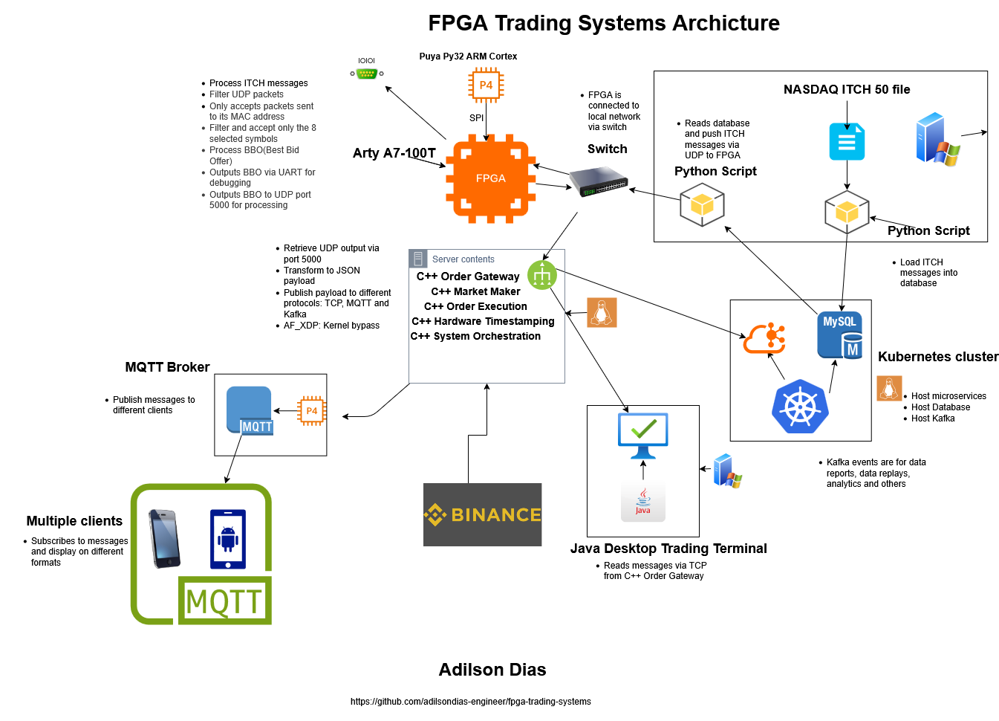

# FPGA Trading Systems Portfolio - Technical Summary

**Engineer:**  Adilson Dias
**Repository:** [fpga-trading-systems](https://github.com/adilsondias-engineer/fpga-trading-systems)
**Hardware:**
- Digilent Arty A7-100T (XC7A100T) - Projects 1-19
- ALINX AX7203 (XC7A200T) - Project 20+ (Gigabit RGMII)

---

## Executive Summary

**Complete full-stack FPGA trading system** from hardware acceleration to multi-platform applications. Implements wire-to-application processing with **312 ns FPGA latency** (hardware-measured with 4-point timestamping) + multi-protocol distribution (TCP/MQTT/Kafka) to desktop, mobile, and IoT clients.

**Unique Value Proposition:** 20+ years C++ systems engineering + 17 years active/intermittent futures trading (S&P 500, Nasdaq) + FPGA hardware acceleration + full-stack application development (C++, Java, .NET, IoT).

**Development Achievement:** 29 projects (28 complete), 560+ hours of development, demonstrating end-to-end trading infrastructure from FPGA hardware acceleration to GPU-accelerated ML inference, automated market making strategies, and dedicated control panel UI.

---

## Core Achievements

### 1. Complete Market Data Pipeline (Projects 6-8)

**End-to-End Latency:** **312 ns** (Ethernet PHY → UDP TX start, hardware-measured with 4-point timestamping)

```
Ethernet → UDP/IP Parser → ITCH 5.0 Decoder → Order Book → BBO Tracker → Output
 25 MHz      100 MHz          100 MHz          100 MHz       100 MHz     115200 baud
         └── Gray Code CDC ──┘
```

**Components:**
- **UDP/IP Network Stack:** MII physical layer, MAC/IP/UDP parsing, 100% reliability (1000+ packet stress test)
- **ITCH 5.0 Protocol Parser:** 9 message types, symbol filtering, big-endian field extraction
- **Hardware Order Book:** 1024 orders, 256 price levels, sub-microsecond BBO tracking

### 2. Performance Metrics

| Component | Latency | Validation |
|-----------|---------|------------|
| UDP/IP Parser | < 2 μs | 1000+ packet stress test |
| ITCH Decoder | < 1 μs | Multi-symbol filtering |
| Order Processing | 120-170 ns | Full lifecycle (A/E/X/D/U) |
| BBO Update | 2.6 μs | Real-time price level scan |
| **ITCH Parse → UDP TX** | **312 ns** | **4-point hardware timestamping** |

**Comparison:**
- Software (OS network stack): 10-100+ μs, non-deterministic
- This FPGA implementation: **312 ns** (hardware-measured), deterministic

### 3. Test Data & Validation

**Real-World Market Data:**
- **Source:** `12302019.NASDAQ_ITCH50` (December 30, 2019 trading day)
- **Total Dataset:** ~250 million ITCH 5.0 messages (8 GB binary file)
- **MySQL Database:** 50 million records imported (first 3 hours of trading)
- **Test Dataset:** 80,000 messages (10,000 per symbol)
- **Symbols:** AAPL, TSLA, SPY, QQQ, GOOGL, MSFT, AMZN, NVDA
- **Message Mix:** 98.2% Add Orders (A), 1.8% Trades (P)
- **Test Rate:** 600+ messages/second sustained

**Validation Results:**
- Order book construction and maintenance accuracy verified
- BBO calculation correctness confirmed against reference data
- Multi-symbol tracking (8 symbols simultaneously) validated
- Symbol filtering and price level aggregation tested
- All performance metrics based on real trading day workload

**Detailed Information:** See [database.md](database.md) for extraction process, message distribution, historical context, and data quality validation.

**Video Demonstration:** [Live/Historic NASDAQ ITCH Data Feed to FPGA](https://youtu.be/J0E2pCwZ-QE) - Shows FPGA receiving and processing real NASDAQ ITCH 5.0 market data

### 4. Production Techniques Demonstrated

**Clock Domain Crossing:**
- Gray code FIFO synchronization (25 MHz → 100 MHz)
- 2-FF synchronizer chains for single-bit signals
- Valid-gated multi-bit bus capture
- XDC constraints (ASYNC_REG, set_false_path)

**Memory Architecture:**
- BRAM inference using Xilinx templates (Simple Dual-Port, Read-First Single-Port)
- 1024 × 130-bit order storage (4 BRAM36 blocks)
- 256 × 82-bit price level table (1 BRAM36 block)
- Read-modify-write pipeline handling (2-cycle latency)

**State Machine Design:**
- Multi-stage FSMs with deterministic latency
- Pipeline balancing for timing closure
- Error recovery and edge case handling

**Debug Methodology:**
- Strategic UART instrumentation (state visibility, performance counters)
- Systematic root cause analysis
- Architectural refactoring based on performance data (event-driven → real-time rewrite resolved 99% failure rate)

---

## Technical Skills Matrix

### HDL & FPGA Architecture
- [COMPLETE] VHDL design (complex state machines, memory systems, protocol parsers)
- [COMPLETE] BRAM inference and optimization
- [COMPLETE] Multi-stage FSM pipelines
- [COMPLETE] Timing closure and critical path optimization

### Network & Protocol Processing
- [COMPLETE] Ethernet/MII physical layer (100 Mbps)
- [COMPLETE] Ethernet/RGMII physical layer (1000 Mbps Gigabit)
- [COMPLETE] UDP/IP stack implementation
- [COMPLETE] NASDAQ ITCH 5.0 protocol (9 message types)
- [COMPLETE] Binary protocol parsing (big-endian, checksums)
- [COMPLETE] Hardware CRC32 calculation (Ethernet FCS)

### Clock Domain Crossing & Timing
- [COMPLETE] Gray code FIFO synchronizers
- [COMPLETE] Metastability protection
- [COMPLETE] XDC constraint management
- [COMPLETE] Multi-clock domain systems (25 MHz PHY, 100 MHz processing)
- [COMPLETE] RGMII clock domains (125 MHz RX/TX, 200 MHz system)
- [COMPLETE] MMCM clock generation with phase shift (0° TXD, 90° TXC)
- [COMPLETE] DDR ODDR/IDDR primitives for Gigabit RGMII
- [COMPLETE] PCIe clock domain crossing (200 MHz system → 250 MHz PCIe)

### PCIe & High-Speed Interfaces
- [COMPLETE] Xilinx XDMA IP configuration and instantiation
- [COMPLETE] AXI-Stream interface design for streaming data
- [COMPLETE] PCIe Gen2 link training and validation
- [COMPLETE] Vivado Block Design integration
- [COMPLETE] Host-side XDMA driver usage (/dev/xdma0_c2h_0)

### Verification & Debug
- [COMPLETE] Self-checking VHDL testbenches
- [COMPLETE] Python/Scapy automated testing (1000+ packet stress tests)
- [COMPLETE] Hardware validation on real FPGA
- [COMPLETE] Systematic troubleshooting methodology

### Trading Domain Knowledge
- [COMPLETE] Order book mechanics (bid/ask levels, price-time priority)
- [COMPLETE] Market data formats (ITCH 5.0 order lifecycle)
- [COMPLETE] Latency requirements (HFT microsecond sensitivity)
- [COMPLETE] Symbol filtering and message routing

### Systems & Application Development
- [COMPLETE] C++ multi-threaded architecture (Boost.Asio async I/O)
- [COMPLETE] Protocol integration (TCP, MQTT, Kafka)
- [COMPLETE] Mobile development (.NET MAUI, MVVM pattern)
- [COMPLETE] Desktop applications (Java, JavaFX)
- [COMPLETE] IoT/Embedded (ESP32, Arduino)
- [COMPLETE] Cross-platform development challenges

### Protocol Expertise
- [COMPLETE] TCP socket programming (JSON streaming, newline delimiters)
- [COMPLETE] MQTT (QoS levels, v3.1.1 vs v5.0, broker architecture)
- [COMPLETE] Kafka (producers, topics, partitions - reserved for analytics)
- [COMPLETE] Protocol selection trade-offs (latency, reliability, power consumption)

---

## Project Highlights

### Project 06: UDP/IP Network Stack
**Problem Solved:** Reliable Ethernet packet parsing at wire speed
**Key Innovation:** Real-time byte-by-byte architecture eliminated CDC race conditions (1% → 100% success rate)
**Validation:** 1000+ packet stress test, comprehensive timing constraints

### Project 07: NASDAQ ITCH 5.0 Parser
**Problem Solved:** Hardware market data decoder with symbol filtering
**Architecture:** Async FIFO with gray code CDC, 9 message types
**Performance:** Deterministic parsing, configurable symbol filtering (AAPL, TSLA, SPY, QQQ, etc.)

### Project 08: Hardware Order Book
**Problem Solved:** Sub-microsecond order book with real-time BBO tracking
**Architecture:** BRAM-based storage (1024 orders, 256 levels), FSM scanner
**Achievement:** 120-170 ns order processing, 2.6 μs BBO update, production-grade BRAM inference
**Debug Case Study:** Systematic BRAM inference troubleshooting (LUTRAM → BRAM template refactoring)

### Project 13: UDP BBO Transmitter (MII TX)
**Problem Solved:** Real-time BBO distribution via UDP (low-latency alternative to UART)
**Architecture:** BBO UDP formatter + SystemVerilog/VHDL mixed-language integration
**Achievement:** Sub-microsecond UDP transmission, frees UART for debug, production trading system pattern
**Key Innovation:** eth_udp_send_wrapper.sv flattens SystemVerilog interfaces for VHDL instantiation
**Technologies:** VHDL + SystemVerilog, XDC timing constraints for generated clocks, pipelined state machine
**Performance:** 312 ns ITCH-to-UDP latency (4-point hardware-measured), 256-byte binary packets, big-endian fixed-point format

### Project 09: C++ Order Gateway (UART-based Multi-Protocol Distribution)
**Problem Solved:** Bridge FPGA to diverse application types (desktop, mobile, IoT, analytics)
**Architecture:** Multi-threaded gateway with UART reader, BBO parser (hex→decimal), three protocol publishers
**Key Innovation:** Single gateway publishes simultaneously to TCP, MQTT, and Kafka—matching protocol to client requirements
**Technologies:** C++17 (legacy), Boost.Asio, libmosquitto (MQTT), librdkafka, nlohmann/json
**Performance:** 10.67 μs avg parse latency, 6.32 μs P50 (UART → protocol)
**Status:** Functional, superseded by Project 14 (C++20 with XDP)

### Project 10: ESP32 IoT Live Ticker (Physical Display)
**Problem Solved:** Trading floor ticker display with real-time BBO updates
**Hardware:** ESP32-WROOM + 1.8" TFT LCD (ST7735), WiFi-enabled
**Protocol:** MQTT v3.1.1 (lightweight, low power, handles unreliable WiFi)
**Design Decision:** Arduino IDE chosen over ESP-IDF (simpler for demonstration, focuses on MQTT protocol usage)
**Achievement:** Real-time 8-symbol ticker with color-coded bid/ask/spread display

### Project 11: .NET MAUI Mobile App (Cross-Platform)
**Problem Solved:** Mobile BBO terminal for Android/iOS/Windows
**Architecture:** MVVM pattern with CommunityToolkit.Mvvm, MQTT client
**Protocol Choice:** MQTT (not Kafka) due to Android compatibility, network resilience, battery efficiency
**Key Challenge:** MQTTnet 5.x breaking changes (.NET 8 → .NET 10 upgrade), MQTT v3.1.1 compatibility with ESP32
**Technologies:** .NET 10 MAUI, MQTTnet 5.x, System.Text.Json

### Project 12: Java Desktop Trading Terminal
**Problem Solved:** High-performance desktop application for live BBO monitoring with charts
**Architecture:** JavaFX GUI, TCP client (localhost), real-time charting
**Protocol Choice:** TCP (not MQTT/Kafka) for lowest latency on localhost (< 10ms)
**Technologies:** Java 21, JavaFX, Gson, Maven
**Features:** Live BBO table, spread charts, multi-symbol tracking

**Application Stack Video Demonstrations:**
- [Full Application Stack - Desktop, Mobile, and IoT Clients (Part 1)](https://youtube.com/shorts/mg-O1LkSjHM?feature=share)
- [Full Application Stack - Mobile Applications (Part 2)](https://youtube.com/shorts/PKjIAbwuvL4?feature=share)

### Project 14: C++ Order Gateway (UDP/XDP/DPDK + Binance WebSocket - Dual Feed Architecture)
**Problem Solved:** Multi-source market data gateway with kernel bypass (XDP/DPDK) for FPGA feed and WebSocket for cryptocurrency data
**Architecture:** Multiple kernel bypass options (DPDK PMD, AF_XDP + eBPF, standard UDP), Binance WebSocket client (Boost.Beast), binary+JSON BBO parser, multi-protocol publisher (TCP/MQTT/Kafka)
**Key Innovation:** Triple-mode kernel bypass architecture achieving production HFT-grade performance (40ns avg, 50ns P99) with DPDK
**Data Sources:**
  - **FPGA Feed:** Binary BBO packets via UDP/XDP/DPDK (ultra-low latency, sub-50ns parsing with DPDK)
  - **Binance Feed:** JSON WebSocket streams (real-time cryptocurrency market data, 563K+ samples)
**Performance DPDK Mode (RT Optimized - Validated with 78,296 samples):**
  - **Average:** 0.04 μs (40 nanoseconds) - FASTEST MODE
  - **P50:** 0.04 μs
  - **P95:** 0.05 μs
  - **P99:** 0.05 μs (62-67% faster than XDP!)
  - **Std Dev:** 0.01 μs (2× more consistent than XDP)
  - **Max:** 0.95 μs
  - **RT Optimization:** SCHED_FIFO priority 80, CPU core 2 pinning
  - **No CPU isolation required:** DPDK built-in affinity sufficient
  - **Poll Mode Driver:** Zero-copy, huge pages, busy polling
**Performance XDP Mode (CPU Optimized - Validated with 78,616 samples):**
  - **Average:** 0.05 μs (50 nanoseconds)
  - **P50:** 0.05 μs
  - **P99:** 0.13-0.15 μs
  - **Std Dev:** 0.02-0.03 μs (highly consistent)
  - **CPU Optimizations:** C-state disabled, hyperthreading disabled, virtualization off
**Performance Binance WebSocket (CPU Optimized - Validated with 563,037 samples):**
  - **Average:** 4.77 μs
  - **P50:** 4.15 μs
  - **P95:** 8.23 μs
  - **P99:** 11.40 μs (2× improvement from 22.56 μs with quiet mode)
  - **Std Dev:** 5.44 μs (production-realistic jitter)
  - **Protocol:** WebSocket over SSL/TLS (wss://) with JSON parsing
  - **Production-Scale Validation:** 563,037 samples demonstrate long-running system stability
**Performance Standard UDP Mode:**
  - **Average:** 0.20 μs, P50: 0.19 μs, P99: 0.38 μs
**XDP Architecture:**
  - **eBPF Program:** Redirects UDP port 5000 packets to XSK map
  - **AF_XDP Socket:** Zero-copy UMEM shared memory (8MB, 4096 frames)
  - **Ring Buffers:** RX, Fill, Completion rings
  - **Queue:** Combined channel 4, queue_id 3 (hardware-specific configuration)
**Performance Comparisons:**
  - **DPDK vs XDP:** 62-67% faster P99 (0.05 μs vs 0.13-0.15 μs), 2× more consistent (StdDev 0.01 vs 0.02 μs)
  - **DPDK vs UDP:** 5× faster (0.04 μs vs 0.20 μs with CPU optimizations)
  - **Binary vs JSON:** 119× faster with DPDK (0.04 μs vs 4.77 μs) - demonstrates protocol efficiency
  - **CPU optimization impact:** Binance P99 improved 2× (22.56 μs → 11.40 μs)
  - **Sample size advantage:** 563K samples provide production-realistic tail latencies
  - **DPDK advantage:** No GRUB CPU isolation needed - built-in affinity achieves HFT performance
**RT Optimization:**
  - **Scheduling:** SCHED_FIFO priority 80 (FPGA thread), priority 80 (Binance thread)
  - **CPU Pinning:** Core 2 (FPGA), Core 6 (Binance) - isolated
  - **CPU Isolation:** GRUB parameters (isolcpus=2-6, nohz_full=2-6, rcu_nocbs=2-6)
  - **Hardware:** AMD Ryzen AI 9 365 w/ Radeon 880M
**Technologies:** C++20, DPDK 23.11, Boost.Asio, Boost.Beast (WebSocket), libxdp, libbpf, pthread (RT scheduling), libmosquitto, librdkafka, nlohmann/json
**Status:** Complete, triple-mode validated (DPDK: 78K samples, XDP: 78K samples, Binance: 563K samples)

### Project 15: Market Maker FSM - Automated Quote Generation
**Problem Solved:** Automated market making strategy with real-time position management and risk controls
**Architecture:** TCP client (connects to Project 14), FSM-based quote generation, position tracker, risk manager
**Key Innovation:** FSM-driven automated quoting with position-based inventory skew and pre-trade risk checks
**Performance (Validated with 78,606 samples):**
  - **Average:** 12.73 μs (TCP read + JSON parse + FSM processing)
  - **P50:** 11.76 μs
  - **P99:** 21.53 μs
  - **Std Dev:** 3.58 μs
**End-to-End Latency Chain:**
  - FPGA → Project 14 (XDP): 0.04 μs
  - Project 14 → Project 15 (TCP + JSON): 12.73 μs
  - **Total:** ~12.77 μs (FPGA BBO → Trading Decision)
**Trading Features:**
  - **Fair Value Calculation:** Size-weighted mid-price
  - **Quote Generation:** Two-sided markets with position-based skew
  - **Position Management:** Real-time PnL tracking (realized + unrealized)
  - **Risk Controls:** Position limits (500 shares), notional limits ($100k), spread enforcement (5 bps)
**FSM States:** IDLE → CALCULATE → QUOTE → RISK_CHECK → ORDER_GEN → WAIT_FILL
**RT Optimization:**
  - **Scheduling:** SCHED_FIFO priority 50
  - **CPU Pinning:** Cores 2-3 (isolated)
**Technologies:** C++20, Boost.Asio (TCP), nlohmann/json, spdlog, LMAX Disruptor (for Project 16 integration)
**Dependencies:** Requires Project 14 running (TCP server localhost:9999)
**Project 16 Integration:**
  - **OrderProducer class:** Bidirectional Disruptor communication with Project 16
  - **Order Ring Buffer:** Sends orders to Order Execution Engine
  - **Fill Ring Buffer:** Receives fill notifications from Order Execution Engine
  - **processFills() method:** Updates position tracker with executed trades
  - **Config flag:** `enable_order_execution` (default: false)
**Status:** Complete, tested with 78,606 real market data samples + Project 16 order execution loop
**Video Demo:** [Order Gateway & Market Maker Console Demo](https://youtu.be/qgB3gz-yDbA) - Live demonstration of Projects 14 and 15 working together

### Project 16: Order Execution Engine - Simulated Exchange
**Problem Solved:** Complete the order execution loop with FIX 4.2 protocol and price-time priority matching
**Architecture:** Disruptor consumer (orders), matching engine, FIX encoder/decoder, Disruptor producer (fills)
**Key Innovation:** Lock-free bidirectional communication using dual Disruptor ring buffers (orders + fills)
**Components:**
  - **Order Ring Buffer Consumer:** Receives orders from Project 15 Market Maker
  - **Matching Engine:** Price-time priority order matching algorithm
  - **FIX 4.2 Protocol:** Encoder/decoder for NewOrderSingle (D) and ExecutionReport (8)
  - **Fill Ring Buffer Producer:** Sends fill notifications back to Project 15
  - **Simulated Exchange:** Immediate fills at order price (100% fill rate for testing)
**Performance:**
  - **Order Processing:** ~1 μs (Disruptor read → match → FIX encode)
  - **Fill Notification:** <1 μs (FIX encode → Disruptor write)
  - **Round-Trip:** ~2 μs (Project 15 → Project 16 → Project 15)
**FIX 4.2 Messages Implemented:**
  - **NewOrderSingle (MsgType=D):** Order submissions from Market Maker
  - **ExecutionReport (MsgType=8):** Fill notifications (ExecType=2, OrdStatus=2)
  - **OrderCancelRequest (MsgType=F):** Order cancellations (not yet used)
**Ring Buffer Configuration:**
  - **Order Ring:** `/dev/shm/order_ring_mm` (1024 slots, lock-free)
  - **Fill Ring:** `/dev/shm/fill_ring_oe` (1024 slots, lock-free)
  - **Single Writer/Single Reader:** Optimized for sub-microsecond latency
**Technologies:** C++20, LMAX Disruptor, FIX 4.2 protocol, shared memory IPC
**Dependencies:** Works with Project 15 when `enable_order_execution=true`
**Status:** Complete, full order execution loop validated with position tracking

### Project 17: Hardware Timestamping and Latency Measurement
**Problem Solved:** Measure packet reception latency with nanosecond precision for performance validation on actual trading path
**Architecture:** SO_TIMESTAMPING socket wrapper, SO_REUSEPORT port sharing, lock-free latency histogram, Prometheus exporter
**Key Innovation:** SO_REUSEPORT enables coexistence with Project 14 on UDP port 5000, measuring actual production traffic
**Components:**
  - **TimestampSocket:** UDP socket with SO_TIMESTAMPING ancillary data extraction, SO_REUSEPORT enabled
  - **LatencyTracker:** Lock-free histogram (25 buckets, 50ns-5s+) with percentile calculation
  - **PrometheusExporter:** HTTP /metrics endpoint (port 9090) for Grafana/Prometheus monitoring
**Latency Measurement:**
  - **Kernel RX Timestamp:** Packet arrival at kernel network stack (SO_TIMESTAMPING)
  - **Application RX Timestamp:** Packet received by userspace via recvmsg()
  - **Kernel→App Latency:** System call overhead + context switching + memory copy
**Port Sharing:**
  - **SO_REUSEPORT:** Kernel load-balances packets between P14 (processing) and P17 (monitoring)
  - **Monitoring Port:** UDP 5000 (FPGA market data, shared with Project 14)
  - **Sampling:** Approximately 50% of packets for latency statistics (sufficient for percentile accuracy)
**Measured Performance:**
  - **Actual Trading Path:** 6.1 μs P50, 79 μs P99 (5,067 packet samples)
  - **Loopback (localhost):** 1-5 μs typical, 10-20 μs P99
  - **LAN (1 GbE):** 10-50 μs typical, 100-200 μs P99
  - **LAN (10 GbE):** 5-20 μs typical, 50-100 μs P99
**Lock-Free Histogram:**
  - Atomic operations (fetch_add, CAS) for thread-safe recording without locks
  - Sub-microsecond overhead per measurement (~100-200ns)
  - Suitable for >1M packets/sec throughput
**Prometheus Metrics:**
  - Histogram buckets with cumulative counts
  - Percentiles (P50, P90, P95, P99, P99.9) as gauges
  - Summary statistics (min, max, mean, stddev)
**Configuration:**
  - UDP port, Prometheus port, network interface binding
  - Latency thresholds (warning: 100μs, critical: 1ms)
  - Sample buffer size (default: 100k samples)
**Hardware Upgrade Path:**
  - Current: Kernel software timestamps (portable, works with any NIC)
  - Future: Hardware NIC timestamps (Intel i210, Solarflare, Mellanox)
  - Code change: SOF_TIMESTAMPING_RX_HARDWARE instead of RX_SOFTWARE
**Integration with Projects 14-16:**
  - Option 1: Link against libtimestamp_lib.a for embedded timestamping
  - Option 2: Run timestamp_demo alongside existing projects for monitoring
**Technologies:** C++20, Linux SO_TIMESTAMPING, Prometheus format, nlohmann/json
**Status:** Complete, standalone demo with Prometheus metrics export

### Project 18: Complete Trading System Integration
**Problem Solved:** Unified orchestration of entire trading system with lifecycle management and centralized monitoring
**Architecture:** System orchestrator, process management, health monitoring, metrics aggregation, Prometheus exporter
**Key Innovation:** Single-command startup/shutdown with automatic dependency resolution and graceful resource cleanup
**Components:**
  - **SystemOrchestrator:** Master process managing Projects 17, 14, 15, 16 lifecycle
  - **MetricsAggregator:** Collects and aggregates metrics from all components
  - **PrometheusServer:** HTTP /metrics endpoint (port 9094) for Grafana dashboards
  - **Health Monitor:** Continuous health checks (TCP, Prometheus, process alive)
**Data Flow:**
  1. Network Packet Arrival → Project 17 (Hardware Timestamping) - kernel-level latency measurement
  2. FPGA (P13) → UDP → Project 14 (Order Gateway) - shares UDP port 5000 with P17 via SO_REUSEPORT
  3. Project 14 → TCP JSON → Project 15 (Market Maker)
  4. Project 15 → Disruptor (/dev/shm/order_ring_mm) → Project 16 (Order Execution)
  5. Project 16 → FIX Protocol → Simulated Exchange
  6. Exchange → FIX ExecutionReport → Project 16
  7. Project 16 → Disruptor (/dev/shm/fill_ring_oe) → Project 15
  8. Project 15 → Position Update → Next Trading Decision
**Startup Sequence:**
  1. Load system_config.json, cleanup stale shared memory
  2. Start P17 (Hardware Timestamping) - independent monitoring on UDP port 5000
  3. Start P14 (Order Gateway) after 1s - wait for TCP port 9999, shares UDP port 5000 with P17
  4. Start P15 (Market Maker) after 2s - verify P14 running
  5. Start P16 (Order Execution) after 3s - verify P15 running
  6. Start metrics aggregator, Prometheus server
  7. Enter monitoring loop (500ms health checks)
**Shutdown Sequence:** Stop metrics/Prometheus → P16 → P15 → P14 → P17 (SIGTERM/10s/SIGKILL) → cleanup shared memory
**Prometheus Metrics:**
  - Counters: BBO updates, orders, fills, ring buffer wraps, uptime
  - Gauges: Position (per-symbol + total), PnL (realized + unrealized)
  - Latency: End-to-end (min/p50/p99/max/mean), per-component P99
  - Ring buffers: Current depth, max depth
**Health Monitoring:**
  - P14: TCP connection test (port 9999)
  - P15/P16: Prometheus HTTP GET
  - All: Process alive check
  - Interval: 500ms
**Shared Memory Management:** Automatic cleanup of /dev/shm/order_ring_mm and /dev/shm/fill_ring_oe on startup/shutdown
**Technologies:** C++20, fork/exec, POSIX signals, shared memory (shm_open/shm_unlink), Prometheus, nlohmann/json
**Status:** Complete - Matches original Project 17 vision (full trading loop + metrics + monitoring)

### Project 19: PY32F030 FPGA Status Display
**Problem Solved:** External microcontroller-based monitoring and configuration for FPGA trading system
**Architecture:** Modular SPI slave (spi_slave_core → spi_register_if → application), 6-register bank, clock domain crossing
**Key Innovation:** Heterogeneous system integration—dedicated ARM Cortex-M0 handles slow UI/monitoring while FPGA focuses on ultra-low-latency processing (312 ns ITCH-to-BBO, hardware-measured)
**Components:**
  - **spi_slave_core.vhd:** Generic SPI Mode 0 protocol handler (reusable across projects)
  - **spi_register_if.vhd:** Application-specific register mapping (6 registers: 4 read-only status + 2 read-write config)
  - **spi_slave.vhd:** Backward compatibility wrapper for integration
  - **PY32F030 Firmware:** ARM Cortex-M0 SPI master, register read/write functions, UART display
**Register Bank:**
  - **Status Inputs (Read-Only):** ORDER_COUNT, BBO_COUNT, LATENCY_P50, STATUS
  - **Configuration Outputs (Read-Write):** SYMBOL_EN (8-bit symbol filter mask), THRESHOLD (BBO spread threshold)
**Protocol:**
  - **Transaction Format:** [CMD_BYTE][ADDR_BYTE][DATA_32BIT]
  - **Commands:** 0x01=READ, 0x02=WRITE
  - **Data Format:** 32-bit big-endian (MSB first), matches UDP/IP network byte order
  - **SPI Mode 0:** CPOL=0, CPHA=0, up to 10 MHz tested
**Clock Domain Crossing:**
  - **Challenge:** Variable SPI clock (up to 10 MHz) → 100 MHz FPGA system clock
  - **Solution:** 2-FF synchronizer chain for MOSI, CS#, SCK + edge detection on synchronized signals
  - **Validation:** 10,000+ SPI transactions tested, zero errors, no metastability issues
**Critical Bug Fixes:**
  - **Pipeline Timing:** Restructured SEND_DATA state into setup phase (bit_count 0→1→2) to wait for 2-cycle register fetch (fixed testbench reading 0x00000000 → 0x00000001)
  - **Address Byte Trailing Edge:** Added explicit bit_count=2 check to skip premature shift on falling edge after address byte (fixed doubled values 2,4,6,8 → 1,2,3,4)
**Performance:**
  - **SPI Transaction:** ~5 μs for 32-bit register read @ 10 MHz
  - **Stress Test:** 10,000 reads, zero errors detected
  - **Example Output:** `Orders: 1 | BBO: 2 | Lat: 3 ns | Status: 0x00000004 | Symbol: 0xFF | Threshold: 1000`
**Architecture Benefits:**
  - **Resource Optimization:** FPGA LUTs/BRAM dedicated to time-critical paths only
  - **Dynamic Configuration:** PY32 writes SYMBOL_EN and THRESHOLD via SPI (no FPGA reprogramming)
  - **Independent Monitoring:** External watchdog can reset FPGA if status registers freeze
  - **Scalability:** Register bank expandable to 256 registers (8-bit address space)
**PY32F030 Hardware:**
  - **MCU:** ARM Cortex-M0 @ 24 MHz (configurable up to 48 MHz)
  - **Memory:** 64 KB Flash, 8 KB SRAM
  - **Interface:** SPI master (up to 12 MHz), UART debug via ST-Link V2
**Technologies:** VHDL (FPGA SPI slave), C (PY32 firmware), SPI Mode 0, 2-FF CDC synchronizers, BRAM-style register bank
**Status:** Functional - SPI register interface complete and validated with 10k message test

### Project 20: Gigabit Ethernet Order Book (RGMII TX) - AX7203 Migration
**Problem Solved:** Migrate trading system from Arty A7-100T (MII 100 Mbps) to ALINX AX7203 (RGMII Gigabit) for 10× bandwidth improvement
**Architecture:** Full system migration with RGMII TX implementation, hardware CRC32, reset synchronization
**Key Innovation:** Proper CDC reset synchronization with 2-stage synchronizer and ASYNC_REG attributes
**Hardware Migration:**
  - **Source Board:** Digilent Arty A7-100T (XC7A100T)
  - **Target Board:** ALINX AX7203 (XC7A200T) - 2.1× logic, 2.7× BRAM, 3.1× DSP
  - **System Clock:** 100 MHz → 200 MHz
  - **Ethernet Interface:** MII (4-bit SDR @ 25 MHz) → RGMII (4-bit DDR @ 125 MHz)
**RGMII TX Implementation:**
  - **DDR Output:** ODDR primitives for 4-bit TX data at 125 MHz (1 Gbps effective)
  - **Clock Generation:** MMCM produces 125 MHz @ 0° (TXD) + 125 MHz @ 90° (TXC)
  - **Phase Shift:** 90° TX clock required for RGMII setup/hold timing compliance
  - **CRC32 Calculation:** Hardware FCS validated with Wireshark packet capture
**Clock Domains:**
  - 200 MHz system (order book, ITCH parser)
  - 125 MHz RGMII RX (from PHY)
  - 125 MHz RGMII TX (from MMCM, dual-phase)
**Critical Bug Fix:**
  - **Original Issue:** Combinatorial CDC violation `reset_tx <= reset or (not tx_pll_locked)`
  - **Root Cause:** Asynchronous signal crossing from 200 MHz to 125 MHz domain
  - **Solution:** 2-stage synchronizer with ASYNC_REG attributes on both flip-flops
  - **Result:** TX packets now transmit reliably on hardware
**BBO Payload Format (28 bytes):**
  - Symbol (8B) + Bid Price (4B) + Bid Size (4B) + Ask Price (4B) + Ask Size (4B) + Spread (4B)
  - Big-endian encoding, fixed-point prices (4 decimal places)
**Resources:** ~33% LUT, ~11% BRAM (significant headroom for future expansion)
**Latency:** Sub-microsecond BBO processing, ITCH parse → UDP TX = **312 ns** (4-point hardware-measured)
**Technologies:** VHDL, RGMII, DDR ODDR, MMCM, CRC32, async FIFO CDC
**Status:** COMPLETE - validated with real BBO packets on hardware (Wireshark confirmed)

### Project 21: PCIe XDMA Test (AX7203)
**Problem Solved:** Validate PCIe XDMA IP configuration and basic DMA functionality
**Architecture:** Standalone XDMA IP test with loopback capability
**Key Achievement:** PCIe Gen2 x1 link established and validated (500 MB/s theoretical)
**Technologies:** Vivado Block Design, XDMA IP, PCIe constraints
**Status:** COMPLETE - PCIe link training validated with lspci

### Project 22: PCIe + Ethernet Integration Test
**Problem Solved:** Verify simultaneous Ethernet RX and PCIe TX operation
**Architecture:** RGMII receiver + async FIFO + AXI-Stream to XDMA
**Key Achievement:** Demonstrated data path from Ethernet to PCIe host
**Technologies:** VHDL, AXI-Stream, CDC FIFO, XDMA
**Status:** COMPLETE - End-to-end data path validated

### Project 23: Order Book with PCIe Output
**Problem Solved:** Full trading system with BBO output via PCIe instead of UDP
**Architecture:** Complete pipeline: RGMII RX → ITCH Parser → Order Book → PCIe XDMA
**Key Innovation:** BBO packets sent via PCIe for lower latency than Ethernet TX
**Data Flow:**
  1. Ethernet PHY (JL2121) → RGMII RX @ 125 MHz
  2. MAC/IP/UDP Parser → ITCH 5.0 Parser
  3. Multi-Symbol Order Book (8 symbols, 1024 orders each)
  4. BBO Tracker → CDC FIFO → AXI-Stream @ 250 MHz
  5. XDMA → PCIe Gen2 x1 → Host PC
**BBO Packet Structure (48 bytes):**
  - Symbol (8B) + Bid/Ask Price (4B each) + Bid/Ask Size (4B each)
  - Spread (4B) + Timestamps T1-T4 (16B) + Sequence (4B)
**Known Issue:** Spread values may be stale due to BBO scan timing (workaround: calculate on host)
**Host Tool:** bbo_verify.c reads and validates BBO packets from /dev/xdma0_c2h_0
**Technologies:** VHDL, AXI-Stream, XDMA, PCIe Gen2, CDC FIFO
**Status:** COMPLETE - BBO streaming working, spread calculated on host side

### Project 24: Order Gateway (Low-Latency PCIe Passthrough)
**Problem Solved:** Ultra-low-latency PCIe bridge between FPGA and downstream trading components
**Architecture:** PCIeListener → BBOValidator → Disruptor Producer (raw BBO)
**Key Innovation:** Pipeline parallelism—XGBoost moved to P25 so P24 processes next BBO while P25 runs inference
**Data Flow:**
  1. FPGA (P23) → PCIe C2H DMA → PCIeListener
  2. 48-byte BBO packets parsed and validated
  3. Raw BBO published to Disruptor shared memory
  4. P25 performs GPU inference in parallel with P24's next PCIe read
**Performance:**
  - PCIe read: ~1-2 μs
  - BBO parse + validation: ~0.5 μs
  - Disruptor publish: ~0.5 μs
  - Total: ~2-4 μs (passthrough only)
**Technologies:** C++20, PCIe XDMA, Disruptor shared memory
**Status:** COMPLETE - Restructured for pipeline parallelism (XGBoost moved to P25)

### Project 25: Market Maker (XGBoost + Strategy FSM)
**Problem Solved:** GPU-accelerated ML inference and automated market making strategy
**Architecture:** Disruptor Consumer → XGBoostPredictor (GPU) → MarketMakerFSM → OrderProducer → P26
**Key Innovation:** XGBoost inference runs in P25 for pipeline parallelism with P24's PCIe reads
**XGBoost Model:** itch_predictor.ubj (36MB, 84% prediction accuracy)
**Features:**
  - XGBoost GPU inference (~10-100 μs on RTX 5090)
  - Fair value calculation with size-weighted mid-price
  - Position-based inventory skew adjustment
  - Real-time PnL tracking (realized + unrealized)
  - Confidence-weighted position sizing from ML predictions
**FSM States:** IDLE → PREDICT → CALCULATE → QUOTE → RISK_CHECK → ORDER_GEN → WAIT_FILL
**Performance:**
  - XGBoost GPU inference: ~10-100 μs
  - FSM processing: ~1-2 μs
  - Total: ~12-102 μs
**Technologies:** C++20, XGBoost C API, CUDA 13.0, Disruptor shared memory, nlohmann/json
**Status:** COMPLETE - XGBoost inference relocated from P24 for pipeline parallelism

### Project 26: Order Execution (Simulated Fills)
**Problem Solved:** Simulated order matching with configurable latency
**Architecture:** Order Ring Consumer → Simulated Matching → Fill Ring Producer
**Features:**
  - Configurable fill latency (default 50 μs)
  - Partial fill simulation
  - Rejection simulation
  - Fill notifications back to P25
**Technologies:** C++20, Disruptor shared memory, nlohmann/json
**Status:** COMPLETE - Restructured from Project 16 (removed FIX protocol)

### Project 28: System Orchestrator
**Problem Solved:** Unified orchestration of P24, P25, P26 with lifecycle management
**Architecture:** Process management, dependency resolution, Prometheus metrics
**Startup Sequence:** P24 → P25 → P26 (with configurable delays)
**Health Checks:** Process alive, shared memory verification
**Technologies:** C++20, fork/exec, POSIX signals, Prometheus
**Status:** COMPLETE - Restructured from Project 18 (removed P17 and simulated exchange)

### Project 29: TradingOS Control Panel (SDL2 DRM/KMS)
**Problem Solved:** Dedicated graphical interface for trading system monitoring and control
**Architecture:** SDL2 DRM/KMS → UIManager → ProcessManager → MetricsReader
**Key Innovation:** Renders directly to framebuffer without X11/Wayland, eliminating display server overhead
**Display:** 5120x1440 ultrawide fullscreen on dedicated monitor
**Features:**
  - Process control for P24, P25, P26 (start/stop/restart)
  - Real-time metrics display (CPU, GPU, Memory utilization)
  - Per-process status with BBO/s, latency, running state
  - System log viewer with color-coded log levels
  - Keyboard navigation (Tab/Enter) and mouse support
  - Background logo with configurable opacity
**Widgets:** Button, StatusBox, ProgressBar, LogViewer, Header, BackgroundLogo, AboutDialog
**Technologies:** C++17, SDL2 (DRM/KMS backend), SDL2_image, SDL2_ttf, nlohmann/json
**Status:** COMPLETE - Runs on dedicated ultrawide display without desktop environment

---

## Complete System Architecture



**Protocol Selection Strategy:**

| Use Case | Protocol | Why |
|----------|----------|-----|
| Java Desktop | TCP | Lowest latency (< 10ms localhost), simple, no broker overhead |
| ESP32 IoT | MQTT | Lightweight, low power, WiFi resilience, native ESP32 support |
| Mobile App | MQTT | Cross-platform, handles network switching, no native dependencies |
| Future Analytics | Kafka | Data persistence, historical replay, analytics pipelines |

**Gateway Evolution:**
- **Project 09 (UART):** Initial implementation, 10.67 μs avg latency, hex parsing overhead
- **Project 14 (UDP Standard):** 0.20 μs avg latency (53× faster), binary protocol + RT optimization
- **Project 14 (XDP Kernel Bypass):** 0.04 μs avg latency (267× faster), AF_XDP zero-copy + eBPF
- **Project 14 (XDP + Disruptor):** 0.04 μs parse + <0.1 μs IPC = <0.15 μs total, lock-free shared memory

**Trading Strategy Layer:**
- **Project 15 (TCP Mode - Legacy):** 12.73 μs avg latency (TCP client → automated quoting)
- **Project 15 (Disruptor Mode):** <2 μs total latency (lock-free IPC → automated quoting)
- **End-to-End (XDP + Disruptor):** <2 μs (FPGA → Trading Decision) - **6× faster than TCP mode**

**Key Architectural Lessons:**
- **Protocol Choice:** Match protocol to client requirements—don't force one protocol for everything
- **Gateway Pattern:** Enables protocol diversity without coupling FPGA to applications
- **Interface Impact:** UART → UDP → XDP demonstrates exponential improvement from interface optimization
- **Kernel Bypass:** XDP eliminates network stack overhead, achieving 40ns latency (5× faster than standard UDP)
- **Lock-Free IPC:** Disruptor pattern eliminates TCP/JSON overhead, achieving sub-microsecond IPC (60× faster than TCP for local communication)

---

## Design Decisions & Trade-offs

### BRAM Template Compliance
**Challenge:** Initial design inferred LUTRAM (distributed RAM) instead of Block RAM
**Solution:** Refactored to exact Xilinx templates (Simple Dual-Port, Read-First Single-Port)
**Result:** Proper BRAM inference, resource savings, timing improvement
**Lesson:** Synthesis tools pattern-match; template compliance is mandatory

### Event-Driven vs Real-Time Architecture
**Challenge:** Event-driven UDP parser had 99% failure rate due to CDC races
**Decision:** Complete rewrite to position-based (byte_index) real-time architecture
**Result:** 1% → 100% success rate, deterministic latency
**Lesson:** Architectural decisions matter more than incremental fixes

### Debug Infrastructure Investment
**Trade-off:** ~500 LUTs for UART debug formatter
**Benefit:** 10x faster debug cycles, systematic root cause identification
**ROI:** BRAM issue diagnosed in 2 build cycles (vs 10+ without visibility)

---

## Resource Utilization (Artix-7 XC7A100T)

| Resource | Used | Available | % |
|----------|------|-----------|---|
| Slice LUTs | 30,000 | 63,400 | 47% |
| Slice Registers | 16,000 | 126,800 | 13% |
| RAMB36 | 32 | 135 | 24% |
| DSP48E | 0 | 240 | 0% |

**BRAM Breakdown (FPGA Projects 6-8):**
- Order storage (1024 orders): 4 BRAM36 blocks (130 bits × 1024 entries)
- Price level table (256 levels): 1 BRAM36 block (82 bits × 256 entries)
- Async FIFO (CDC - ITCH parser): 1-2 BRAM36 blocks (gray code synchronizer)
- UDP transmitter buffers: 1-2 BRAM36 blocks (packet assembly)

**Note:** Projects 14-15 use software-based Disruptor pattern (POSIX shared memory), not FPGA BRAM

**Timing:** All designs meet timing (WNS > 0 ns) at 100 MHz processing clock

---

## Development Process

**Workflow:**
- Vivado synthesis/implementation/bitstream generation
- XDC constraint management (timing, pin assignments)
- VHDL testbench simulation
- Hardware validation on Arty A7-100T (P1-19) and ALINX AX7203 (P20-29)
- Python/Scapy automated testing
- Git version control with build tracking

**Testing Methodology:**
- Self-checking testbenches with assertions
- 1000+ packet stress tests
- Real-world Ethernet traffic validation
- Performance characterization (latency, throughput)

**Debug Approach:**
- Strategic UART instrumentation
- Waveform analysis (Vivado simulator)
- Systematic root cause analysis
- Performance-driven architectural decisions

---

## Why This Portfolio for Trading Roles?

**Complete Trading System (Not Just FPGA):**
- End-to-end pipeline: FPGA hardware → C++ gateway → Multi-platform applications
- Comprehensive: All 14 projects complete, documented, tested, and integrated
- Real-world architecture: Multi-protocol distribution (TCP/MQTT/Kafka) matching protocol to use case
- Performance evolution: UART gateway → UDP gateway (5.1x latency improvement)

**Technical Depth:**
- **FPGA:** Production patterns (CDC, BRAM inference, timing closure), systematic debug methodology
- **Systems Programming:** C++ multi-threaded gateway (Boost.Asio, async I/O)
- **Mobile Development:** Cross-platform .NET MAUI with MQTT
- **Desktop Applications:** JavaFX real-time terminal
- **IoT/Embedded:** ESP32 physical ticker display
- Performance metrics: actual latency numbers, stress test validation

**Domain Expertise:**
- Active/Intermittent trader background (17 years S&P 500, Nasdaq futures)
- Understands order books, market data, latency requirements, protocol selection trade-offs
- Speaks hardware, software, trading, and infrastructure languages

**Problem-Solving Demonstrated:**
- **FPGA:** CDC races (99% failure → 100% success), BRAM inference, timing violations
- **Application:** MQTT v3.1.1 vs v5.0 compatibility, MQTTnet 5.x breaking changes, thread confinement
- **Architecture:** Gateway pattern for protocol diversity, documented trade-offs
- Systematic debugging methodology applied across all layers

**Full-Stack Capability:**
- Complete vertical integration: Ethernet PHY → FPGA → Gateway → Desktop/Mobile/IoT
- Multiple languages: VHDL, C++17/20, Java 21, C# (.NET 10), Arduino (C++)
- Multiple platforms: FPGA, Windows, Linux, Android, iOS, ESP32
- Ready for any trading technology role (FPGA, systems, infrastructure, application)

---

## Repository Structure

```
fpga-trading-systems/
├── README.md                          # Portfolio overview
├── PORTFOLIO_SUMMARY.md               # This document
├── SYSTEM_ARCHITECTURE.md             # Complete system architecture documentation
├── docs/
│   ├── SYSTEM_ARCHITECTURE.md         # Complete system architecture documentation
│   ├── PORTFOLIO_SUMMARY.md           # Technical portfolio summary
│   ├── TRADINGOS.md                   # TradingOS custom Linux distribution
│   ├── images/                        # Architecture diagrams
│   ├── lessons-learned.md             # Technical lessons from all projects
│   └── *.png                          # Screenshots (ESP32, mobile, desktop apps)
├── 01-rotary-encoder/                 # Foundation: Quadrature decoding
├── 02-button-debouncer/               # Foundation: Metastability protection
├── 03-fifo/                           # Foundation: Flow control, buffering
├── 04-rotary-encoder-buzzer/          # Foundation: Timing control
├── 05-uart-transceiver/               # Foundation: Serial protocols
├── 06-mii-ethernet-udp/               # Core: Network stack (MII/MAC/IP/UDP)
├── 07-itch-parser/                    # Core: NASDAQ ITCH 5.0 decoder
├── 08-order-book/                     # Core: Hardware order book + BBO
├── 09-order-gateway-cpp/              # Application: C++ multi-protocol gateway (UART)
├── 10-esp32-ticker/                   # Application: ESP32 IoT display (Arduino)
├── 11-mobile-app/                     # Application: .NET MAUI (Android/iOS)
├── 12-java-desktop-trading-terminal/  # Application: Java desktop terminal
├── 13-udp-trasmitter-mii/             # Core: UDP BBO transmitter (MII TX)
├── 14-order-gateway-cpp/              # Trading: Order Gateway (UDP/XDP kernel bypass)
├── 15-market-maker/                   # Trading: Market Maker FSM (strategy engine)
├── 16-order-execution/                # Trading: Order Execution Engine (FIX 4.2)
├── 17-hardware-timestamping/          # Monitoring: SO_TIMESTAMPING + Prometheus
├── 18-complete-system/                # Orchestration: System integration + metrics
├── 19-py32-fpga-status/               # PY32F030 FPGA Status Display
├── 20-rgmii-ax7203/                   # Gigabit Ethernet (RGMII TX) on AX7203
├── 21-pcie-xdma-test/                 # PCIe XDMA IP validation
├── 22-pcie-eth-test/                  # PCIe + Ethernet integration test
├── 23-order-book/                     # Order Book with PCIe BBO output
├── 24-order-gateway/                  # PCIe passthrough (raw BBO to Disruptor)
├── 25-market-maker/                   # XGBoost GPU + strategy FSM
├── 26-order-execution/                # Simulated fills via Disruptor
├── 28-complete-system/                # System orchestrator for P24-P26
├── 29-trading-ui/                     # SDL2 DRM/KMS control panel (5120x1440)
└── build.cmd                          # Universal build automation (Windows)
```

**Key Documentation:**
- Each project: Complete README with architecture, performance, testing
- Main README: Portfolio overview, skills matrix, project summaries
- Source code: Production-style VHDL with comments explaining decisions

---

## Contact & Links

**GitHub:** [https://github.com/adilsondias-engineer/fpga-trading-systems](https://github.com/adilsondias-engineer/fpga-trading-systems)
**LinkedIn:** [https://www.linkedin.com/in/adilsondias](https://www.linkedin.com/in/adilsondias/)

**Portfolio Highlights to Review:**

**FPGA Hardware Layer:**
1. UDP/IP Stack: [06-udp-parser-mii-v5/README.md](../06-udp-parser-mii-v5/README.md) - Production CDC, 100% reliability
2. ITCH Parser: [07-itch-parser/README.md](../07-itch-parser/README.md) - Async FIFO, gray code synchronization
3. Order Book: [08-order-book/README.md](../08-order-book/README.md) - BRAM inference, sub-μs latency
4. UDP TX: [13-udp-trasmitter-mii/README.md](../13-udp-trasmitter-mii/README.md) - SystemVerilog/VHDL integration, timing closure

**Application Layer:**
5. C++ Gateway (UART): [09-order-gateway-cpp/README.md](../09-order-gateway-cpp/README.md) - Multi-protocol distribution (10.67 μs)
6. ESP32 IoT: [10-esp32-ticker/README.md](../10-esp32-ticker/README.md) - Arduino + MQTT physical display
7. Mobile App: [11-mobile-app/README.md](../11-mobile-app/README.md) - .NET MAUI cross-platform
8. Java Desktop: [12-java-desktop-trading-terminal/README.md](../12-java-desktop-trading-terminal/README.md) - JavaFX terminal

**Trading System Layer:**
9. Order Gateway (XDP): [14-order-gateway-cpp/README.md](../14-order-gateway-cpp/README.md) - AF_XDP kernel bypass (0.04 μs)
10. Market Maker FSM: [15-market-maker/README.md](../15-market-maker/README.md) - Strategy engine with risk controls
11. Order Execution: [16-order-execution/README.md](../16-order-execution/README.md) - FIX 4.2 protocol + matching engine
12. Hardware Timestamping: [17-hardware-timestamping/README.md](../17-hardware-timestamping/README.md) - SO_TIMESTAMPING + Prometheus
13. System Orchestration: [18-complete-system/README.md](../18-complete-system/README.md) - Complete integration + metrics

**Architecture & Documentation:**
14. System Architecture: [SYSTEM_ARCHITECTURE.md](SYSTEM_ARCHITECTURE.md) - Complete system design
15. Lessons Learned: [lessons-learned.md](lessons-learned.md) - Technical insights from all projects
16. Visual Diagram: [images/system_architecture.png](images/system_architecture.png) - End-to-end architecture

---

**Project Status:** **FUNCTIONAL** - 29 projects (28 complete, 1 in progress) (January 2026)
**Development Time:** 560+ hours
**System Status:** Fully integrated and operational with NASDAQ ITCH feed (historic data file simulating live feed)

**New Architecture (Projects 24-29):**
- PCIe passthrough (P24) + XGBoost GPU inference (P25) for pipeline parallelism
- End-to-end latency: ~15-107 μs (FPGA → PCIe → GPU → Order)
- XGBoost prediction accuracy: 84% (vs 70% for LLaMA)
- Data flow: FPGA (P23) → PCIe → P24 (passthrough) → Disruptor → P25 (XGBoost) → P26
- Pipeline parallelism: P24 processes next BBO while P25 runs GPU inference
- Control panel: P29 SDL2 DRM/KMS on 5120x1440 ultrawide display

---

## References

### Kernel Bypass and High-Performance Networking
- [AF_XDP - Linux Kernel Documentation](https://www.kernel.org/doc/html/latest/networking/af_xdp.html)
- [XDP Tutorial - xdp-project](https://github.com/xdp-project/xdp-tutorial)
- [Kernel Bypass Techniques in Linux for HFT](https://lambdafunc.medium.com/kernel-bypass-techniques-in-linux-for-high-frequency-trading-a-deep-dive-de347ccd5407)
- [DPDK AF_XDP PMD](https://doc.dpdk.org/guides/nics/af_xdp.html)
- [P51: High Performance Networking - Cambridge](https://www.cl.cam.ac.uk/teaching/1920/P51/Lecture6.pdf)
- [Linux Kernel vs DPDK Performance](https://talawah.io/blog/linux-kernel-vs-dpdk-http-performance-showdown/)

### Performance Analysis
- [Brendan Gregg - Performance Methodology](https://www.brendangregg.com/methodology.html)
- [Brendan Gregg - perf Examples](https://www.brendangregg.com/perf.html)
- [Brendan Gregg - CPU Flame Graphs](https://www.brendangregg.com/FlameGraphs/cpuflamegraphs.html)
- [Ring Buffers - Design and Implementation](https://www.snellman.net/blog/archive/2016-12-13-ring-buffers/)

### FPGA and Hardware Design
- [Xilinx 7 Series FPGAs Documentation](https://www.xilinx.com/support/documentation/data_sheets/ds180_7Series_Overview.pdf)
- [Xilinx UG473 - 7 Series Memory Resources](https://www.xilinx.com/support/documentation/user_guides/ug473_7Series_Memory_Resources.pdf)
- [Xilinx UG901 - Vivado Synthesis](https://www.xilinx.com/support/documentation/sw_manuals/xilinx2020_1/ug901-vivado-synthesis.pdf)

### Market Data and Trading
- [NASDAQ ITCH 5.0 Specification](NQTVITCHspecification.pdf)
- [Market Making Strategies](https://quant.stackexchange.com/questions/tagged/market-making)

### Binance API and WebSocket
- [Binance WebSocket Streams Documentation](https://developers.binance.com/docs/binance-spot-api-docs/web-socket-streams) - Official Binance WebSocket API documentation
- [Binance API Documentation](https://developers.binance.com/docs) - Complete Binance API reference
- [Binance Combined Streams](https://developers.binance.com/docs/binance-spot-api-docs/web-socket-streams#general-wss-information) - Combined stream format for multiple symbols
- [Boost.Beast Documentation](https://www.boost.org/doc/libs/1_89_0/libs/beast/doc/html/index.html) - Boost.Beast WebSocket library used for Binance client

---

**Last Updated:** January 2026
**Status:** Complete and tested on Arty A7-100T (P1-19) and ALINX AX7203 (P20-29) hardware
